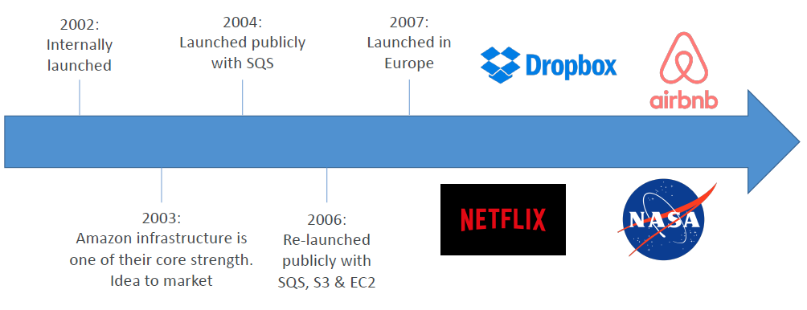
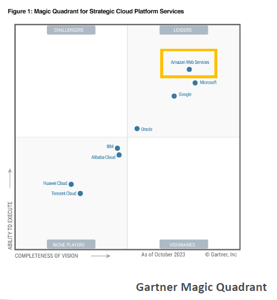
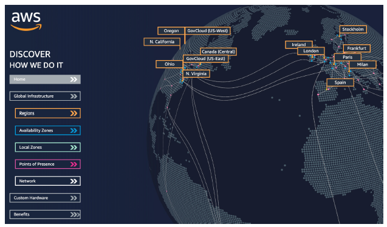
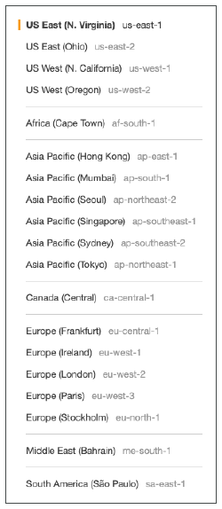
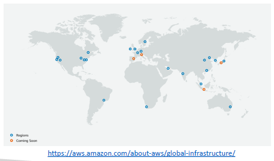
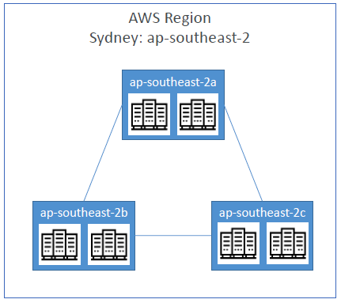
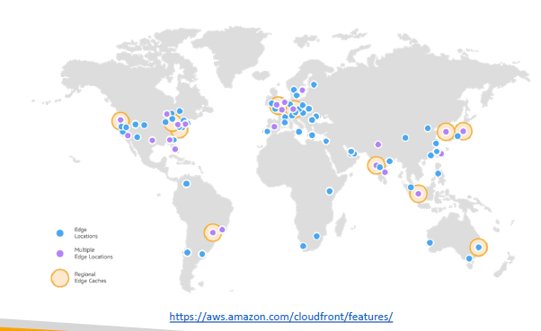

# AWS Cloud Overview - Regions & AZ

- [AWS Cloud Overview - Regions \& AZ](#aws-cloud-overview---regions--az)
  - [History of AWS Cloud](#history-of-aws-cloud)
  - [AWS Today](#aws-today)
  - [What Can You Build on AWS?](#what-can-you-build-on-aws)
    - [Use Cases:](#use-cases)
  - [AWS Global Infrastructure](#aws-global-infrastructure)
  - [AWS Regions](#aws-regions)
    - [Choosing an AWS Region](#choosing-an-aws-region)
  - [Availability Zones](#availability-zones)
  - [Points of Presence and Edge Locations](#points-of-presence-and-edge-locations)
  - [AWS Console Tour](#aws-console-tour)
  - [Key Takeaways](#key-takeaways)

## History of AWS Cloud

* AWS was launched internally at Amazon.com in 2002 because they realized that IT departments could be externalized. Their Amazon infrastructure was one of their core strengths, and they thought, "Maybe we can do IT for someone else, for other people."
* They launched their first offering publicly, which was **SQS**, in 2004. In 2006, they expanded their offering and relaunched with the availability of **SQS**, **S3**, and **EC2**. Don't worry, we will see all these services in this course.
* Then they expanded and said, "We don't have to be just in America. We could be in Europe." Fast forward to today, many applications that used to run, or are still running on AWS include **Dropbox, Netflix, AirBNB, and even NASA**.

---

## AWS Today

* If you look at the Magic Quadrant from Gartner, you can see that AWS is a leader, and it has been the case for many years. AWS now has **$90 billion in revenue as of 2023**, and it accounts for about **31% of the market in Q1 2024**, with Microsoft being second with 25%.
* AWS has been a pioneer and leader of the market for **13 consecutive years** and has over **1 million active users**. Learning AWS really sets you up for success in the cloud world.

---

## What Can You Build on AWS?

* Pretty much everything. AWS enables you to build sophisticated and scalable applications applicable to a diverse set of industries. Every company has a use case for the cloud. **Netflix, McDonald's, 21st Century Fox, and Activision** are all using the cloud.

### Use Cases:
* Transferring your enterprise IT
* Using the cloud as backup and storage
* Performing big data analytics
* Hosting websites
* Creating backends for mobile and social applications
* Running entire gaming servers on the cloud

The applications are endless.

---

## AWS Global Infrastructure

* AWS is global, consisting of 
  * AWS regions
  * Availability Zones
  * Data Centers
  * Edge Locations 
  * Points of Presence
* These components can be represented on a global map: https://infrastructure.aws/

* On the AWS website, you can see that AWS has multiple regions around the world, marked in orange. Examples include **Paris, Spain, Ohio, Sao Paulo, Cape Town, Mumbai, and many others**. AWS truly is a global service.
* Each region is connected through a private AWS network. Within each region, such as Cape Town, there are blue dots representing **availability zones**

**Key takeaway:** AWS is truly global, and you can leverage the infrastructure of a cloud provider to make your application global.

---

## AWS Regions

* Regions are located all around the world, as seen on the map. Each region has a name, such as **US-east-1** or **EU-West-3**, which maps to a code used in the AWS console.

* A region is essentially a cluster of data centers located near each other, for example, in **Ohio, Singapore, Sydney, or Tokyo**.

* Most AWS services are scoped to a specific region. This means that if you use a service in one region and try to use it in another, it will be treated as a new instance of the service.

---

### Choosing an AWS Region

* When launching a new application, deciding where to deploy it depends on several factors:
  * **Compliance:** Some governments require data to remain local to the country. For example, data in France may have to stay in France, so you should launch your application in the French region.
  * **Latency:** Deploying your application close to your users reduces latency. For instance, if most users are in America, deploying in America is preferable to deploying in Australia.
  * **Service Availability:** Not all regions have all services. You need to ensure the region you choose supports the services your application requires.
  * **Pricing:** Pricing varies between regions. Consult the services pricing pages to understand cost differences, which may impact your deployment decision.

---

## Availability Zones

* Availability zones are components within a region. Each region typically has a minimum of three and a maximum of six availability zones, with three being usual.
* For example, the **Sydney region (code ap-southeast-2)** has three availability zones: **ap-southeast-2A, ap-southeast-2B, and ap-southeast-2C**.
* Each availability zone consists of one or more discrete data centers with redundant power, networking, and connectivity. For instance, **ap-southeast-2A** might have two data centers, and similarly for 2B and 2C, though the exact number is not publicly disclosed.
* These availability zones are **isolated from each other to prevent cascading failures**. If an issue occurs in ap-southeast-2A, it is designed not to affect ap-southeast-2B or ap-southeast-2C.
* Availability zones are connected with high bandwidth, ultra-low latency networking, and together they form a region.

---

## Points of Presence and Edge Locations

* AWS has more than **400 points of presence in 90 cities across 40 countries**. These points of presence, also known as **edge locations**, help deliver content to end users with the lowest latency possible.
* These will be covered in detail in the global section of this course, but it is important to know their role in AWS's global infrastructure.

---

## AWS Console Tour

* AWS has global services such as:
  * IAM
  * Route 53
  * CloudFront 
  * WAF. 
* Most AWS services are region-scoped, including:
  *  Amazon EC2
  *  Elastic Beanstalk
  *  Lambda
  *  Rekognition
* To check if a service is available in your region, you should consult the region table provided in the AWS console: https://aws.amazon.com/about-aws/global-infrastructure/regional-product-services

---

## Key Takeaways

* AWS was launched internally at Amazon.com in 2002 and publicly introduced SQS in 2004.
* AWS offers global infrastructure with regions, availability zones, data centers, edge locations, and points of presence.
* Choosing an AWS region depends on factors such as compliance, latency, service availability, and pricing.
* Availability zones within regions are isolated data centers designed for fault tolerance and connected with high bandwidth, low latency networking.