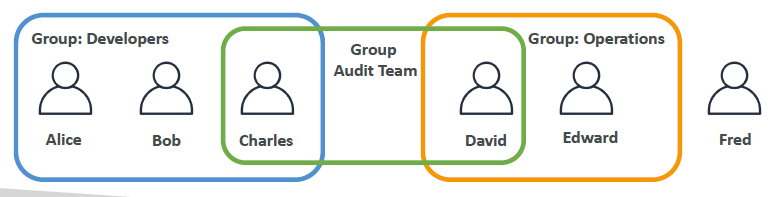
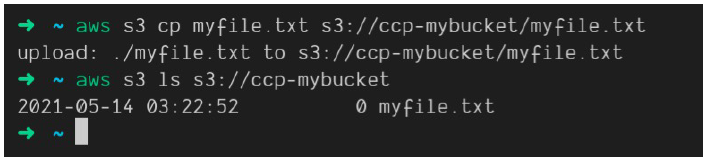

# IAM: Identity Access & Management (IAM)

- [IAM: Identity Access \& Management (IAM)](#iam-identity-access--management-iam)
  - [What Is IAM?](#what-is-iam)
    - [IAM: Users \& Groups](#iam-users--groups)
    - [IAM: Permissions](#iam-permissions)
    - [IAM Policies Inheritance](#iam-policies-inheritance)
    - [IAM Policies Structure](#iam-policies-structure)
      - [Example IAM Policy](#example-iam-policy)
    - [IAM – Password Policy](#iam--password-policy)
    - [MFA Device Options](#mfa-device-options)
  - [Multi-Factor Authentication (MFA)](#multi-factor-authentication-mfa)
    - [Benefits of MFA](#benefits-of-mfa)
  - [MFA Devices Options in AWS](#mfa-devices-options-in-aws)
  - [How Can Users Access AWS?](#how-can-users-access-aws)
  - [What’s the AWS CLI?](#whats-the-aws-cli)
    - [Key Features of AWS CLI:](#key-features-of-aws-cli)
    - [Example Commands:](#example-commands)
  - [What’s the AWS SDK?](#whats-the-aws-sdk)
    - [Key Features of AWS SDK:](#key-features-of-aws-sdk)
    - [Example Usage (Python boto3 SDK):](#example-usage-python-boto3-sdk)
  - [AWS CloudShell](#aws-cloudshell)
  - [IAM Roles for AWS Services](#iam-roles-for-aws-services)
  - [IAM Security Tools](#iam-security-tools)
  - [IAM Guidelines \& Best Practices](#iam-guidelines--best-practices)
  - [Shared Responsibility Model for IAM](#shared-responsibility-model-for-iam)
  - [IAM Section – Summary](#iam-section--summary)

## What Is IAM?

* **Identity and Access Management (IAM)** is a web service for securely controlling access to AWS resources.
* Root Account created by default, should not be used or shared.
* Groups can only contain users, not other groups.
* Users don't have to belong to a group, and user can belong to multiple groups.



* Allows you to manage:
  * **Users**: Each user represents a person in your organization who interact with AWS services and can be grouped.
  * **Groups**: Collection of IAM users with similar access permissions.
  * **Roles**: Set of permissions to be assumed by AWS services or applications.

### IAM: Users & Groups

* **Users**: Represent individual identities that interact with AWS services. Users have unique credentials (username, password, access keys).
* **Groups**: Logical grouping of users to simplify permission management.
  * Permissions assigned to a group are automatically inherited by its users.
* Flexibility in User Management in IAM, users do not have to belong to a group, and a user can belong to multiple groups. This allows user to manage access permissions in a granular and efficient manner. For example, a user could belong to both the “QAs" group and the “Developers” group, inheriting permissions from both.

| **IAM Users**                                              | **IAM Groups**                                           |
|------------------------------------------------------------|----------------------------------------------------------|
| Unique identity for accessing AWS services.                | Logical grouping of users to apply common permissions.    |
| Each user has individual permissions based on policies.    | Adding/removing users from groups automatically changes their permissions. |

### IAM: Permissions
* We create users and groups because we want to allow them to use our AWS accounts. In order to allow them to access we need to provide them permissions.
* Users or Groups can be assigned JSON documents called policies.
* Policies allow us to define **permissions** of the users.
* Policies specify what actions a user or a user within a group are allowed to do or denied on specific resources.
* Policies can be attached to:
  * **Users**
  * **Groups**
  * **Roles**
* In AWS you apply the **least privilege principle**: don't give more permissions than a user needs.
```json
{
  "Version": "2012-10-17",
  "Statement": [
    {
      "Effect": "Allow",
      "Action": "ec2:Describe",
      "Resource": "*"
    },
    {
      "Effect": "Allow",
      "Action": "elasticloadbalancing:Describe",
      "Resource": "*"
    },
    {
      "Effect": "Allow",
      "Action": [ 
        "cloudWatch:ListMetrics",
        "cloudWatch:GetMetricStatistics",
        "cloudWatch:Describe"
      ],
      "Resource": "*"
    }
  ]
}
```

### IAM Policies Inheritance


* Policies are evaluated together for a user, including:
  * **Directly attached policies**.
  * **Group policies**.
  * **Policies attached to roles**.
* If multiple policies apply, IAM combines them to evaluate the final permission set.

| **Policy Type**                 | **Description**                                                                                  |
|---------------------------------|------------------------------------------------------------------------------------------------|
| **Inline Policies**             | Directly attached to a single user, group, or role.                                              |
| **Managed Policies**            | Reusable policies created and maintained by AWS (AWS-managed) or the customer (Customer-managed). |
| **Group Inherited Policies**     | Policies assigned to groups apply to all users in that group.                                    |

### IAM Policies Structure

* Policies are JSON documents that define permissions.
* Key elements of a policy:
  1. **Version**: Policy language version, always include `2012-10-17`.
  2. **Id**: An identifier for the policy (optional)
  3. **Statement**: Contains one or more permissions (required).
* Statement consists of:
  1. **Sid**: An identifier for the statement (optional).
  2. **Effect**: Either `Allow` or `Deny`.
  3. **Principal**: account/user/group to which this policy is applied to.
  4. **Action**: Specifies which AWS service actions are allowed or denied based on **Effect**.
  5. **Resource**: Specifies the AWS resources to which the actions ares applied to.
  6. **Condition**: Conditions for when this policy is in effect (optional).

#### Example IAM Policy

```json
{
  "Version": "2012-10-17",
  "Statement": [
    {
      "Effect": "Allow",
      "Action": "s3:ListBucket",
      "Resource": "arn:aws:s3:::example-bucket"
    }
  ]
}
```

### IAM – Password Policy

* Once users and groups are created we need to protect them from being compromised.
* We have two defense mechanisms
  * **Password Policy** * because the stronger the password you use, more security for your accounts.
    * AWS allows you to define a password policy for IAM users to ensure strong security standards.
    * You can enforce specific rules to make sure passwords are complex and secure.
    * **Minimum password length**: Set a minimum number of characters (e.g., at least 8 characters).
    * **Require specific character types**:
       * Lowercase letters.
       * Uppercase letters.
       * Numbers.
       * Non-alphanumeric characters (special symbols like `!`, `@`, `#`).
    * Allow all IAM users to change their own passwords.
    * Require users to change their password after some time (password expiration). Set the password to expire after a certain period (e.g., 90 days) to prompt users to change their passwords.
    * Prevent password reuse (e.g., prevent using the last 3 passwords).
  * **Multi-Factor Authentication (MFA)**: 
    * Users have access to your account and can possibly change configurations or delete resources in your AWS account.
    * You want to protect your Root Accounts and IAM users.
    * MFA is a comination of a password *you know* and a security device *you own*.
    * For example, let's take Alice. Alice knows her password, but she also has an MFA generating token and by using these things together while logging in, she's going to be able to do a successful login on MFA.

    

    * Main benefit of MFA: if a password is stolen or hacked, the account is not compromised because the hacker will need to also get a hold of the physical device of Alice, that could be her phone, for example, to do a login.
    * Enforce MFA for extra security, requiring both a password and a second authentication factor.

### MFA Device Options


* The first one is a virtual MFA device. You can use Google Authenticator, which is just working on one phone at a time, or using Authy. For Authy, you have support for multiple tokens on a single device. That means that with the virtual MFA device, you can have your root account, your IAM user, another account, another IAM user. It's up to you. You can have as many users and accounts as you want on your virtual MFA device, which make it a very easy solution to use. 
* Now we have another thing called a **Universal 2nd Factor or U2F Security Key**, and that is a physical device. For example, a YubiKey by Yubico. Yubico is a third party to AWS. This is not AWS that provides it. This is a third party and we use a physical device maybe it's super easy, you put it on your key fobs and you're good to go. Tthis YubiKey supports multiple root and IAM users using a single security key. You don't need as many keys as users, otherwise there will be a nightmare.


* Then you have other options. You have a hardware key fob MFA device, for example, this one provided by Gemalto, which is also a third party to AWS. 
* Finally, if you are using the cloud of the government in the US, the **AWS GovCloud**, then you have a special key fob that looks like this that is provided by SurePassID, which is also a third party.

## Multi-Factor Authentication (MFA)

* **MFA** adds an extra layer of protection on top of a username and password.
* With MFA enabled, when a user signs in, they must provide:
  1. Their **password** (something they know).
  2. An **authentication code** from their MFA device (something they have).
* Even if a user’s password is compromised, MFA can prevent unauthorized access.

### Benefits of MFA

* Enhances account security by requiring a second form of authentication.
* Reduces the risk of credential compromise and unauthorized access.
* AWS recommends enabling MFA for all IAM users, especially for root accounts and privileged users.
* Main benefit of MFA: if a password is stolen or hacked, the account is not compromised

## MFA Devices Options in AWS

AWS supports several types of MFA devices:

| **MFA Device Type**                             | **Description**                                                                                                          |
|------------------------------------------------|--------------------------------------------------------------------------------------------------------------------------|
| **Virtual MFA Device**                          | Uses apps like Google Authenticator or Authy. Generates a time-based one-time password (TOTP) on a smartphone or tablet.  |
| **Hardware MFA Device**                         | Physical devices like Gemalto tokens that generate time-based codes.                                                     |
| **U2F Security Key**                            | USB devices supporting the Universal 2nd Factor (U2F) standard. Typically used for browser-based sign-ins.               |
| **AWS Multi-Factor Authentication (MFA)**       | AWS offers its own MFA solutions integrated with IAM to easily configure and manage MFA devices for users.               |

## How Can Users Access AWS?

* AWS provides multiple ways for users to access resources:

| **Access Method**              | **Description**                                                                                                                                                 |
|--------------------------------|-----------------------------------------------------------------------------------------------------------------------------------------------------------------|
| **AWS Management Console**     | A web-based user interface for interacting with and managing AWS resources visually. Best for beginners and infrequent tasks. This is protected by your username, password, maybe multifactor authentication.                                   |
| **AWS Command Line Interface (CLI)** | A unified tool to interact with AWS services using commands in your terminal. Suitable for automation and developers. Protected by access keys which we download which allows us to access AWS from our terminal.                                          |
| **AWS Software Development Kits (SDKs)** | Language-specific APIs for programmatically accessing AWS services using programming languages like Python, JavaScript, Java, Ruby, etc. Protected by the exact same access keys.                      |
| **AWS CloudFormation**         | A service to define and provision AWS infrastructure using code (Infrastructure as Code – IaC). Allows creating stacks and automating deployment configurations.  |
| **AWS Mobile Console**         | Provides mobile access to manage AWS services on-the-go.                                                                                                         |
* Access Keys are generated through the AWS Management Console.
* Users manage their own access keys.
* Access keys, from the user perspective, are secret, just like a password, so if you generate your own access keys do not share them with your colleagues, because they can generate their own access keys as well. 
* Make sure that you treat your access key ID just like your username. 
* Make sure that you treat your secret access key just like your password, you do not share them with other people.


* When Access Key ID and Secret Access Key are loaded into CLI, would allow us to access the AWS API.

## What’s the AWS CLI?

* CLI stands for **Command Line Interface**, and the AWS CLI is a tool that allows you to interact with the AWS services using commands from your command-line shell.



* Whenever you see some code where you type a command line, and then it returns a result, for example, aws, s3, cp, and so on, this is what we call the CLI. We are using the AWS CLI because we start every command by the word AWS. 
* With this CLI, you get direct access to the public APIs of your AWS services which is going to be very helpful in this course. And, then, using the CLI you can develop scripts to manage your resources and automate some of your tasks. 
* Supports both Windows, macOS, and Linux.
* The CLI is open-source, you can find all the source code on GitHub - https://github.com/aws/aws-cli.
* It is an alternative to using the AWS Management console. Some people, actually, do not even use the Management console, they only use the CLI, for example.

### Key Features of AWS CLI:

1. **Command automation**: Write scripts to automate frequent AWS tasks.
2. **Access to all services**: Interact with any AWS service and manage resources from the command line.
3. **Profile management**: Manage multiple AWS accounts using different named profiles.
4. **JSON and YAML output**: Format CLI responses for better readability or integration with other tools.

### Example Commands:

```bash
# List all S3 buckets in your account
aws s3 ls

# Describe EC2 instances in a specific region
aws ec2 describe-instances --region us-west-2
```

## What’s the AWS SDK?

* AWS SDK (Software Development Kit) allows developers to interact with AWS services using various programming languages.
* Language specific APIs * 
  * Python (boto3), JavaScript (aws-sdk), Java, .NET, Ruby, PHP, and more.
  * Mobile SDKs (Android, iOS, ...)
  * IoT Device SDKs (Embedded C, Arduino, ...)
* SDKs provide simplified APIs, making it easier to work with AWS services programmatically without dealing with low-level API calls.
* Example: AWS CLI is built on AWS SDK for Python named Boto3.

### Key Features of AWS SDK:

* API abstraction: Higher-level abstractions simplify complex operations like S3 object uploads or DynamoDB queries.
* Cross-service integration: SDKs help integrate multiple AWS services together within applications.
* Authentication: Easily manage credentials and authenticate requests using IAM roles or user access keys.
* Retry logic: Handles transient network issues with built-in retry logic.

### Example Usage (Python boto3 SDK):

```Python
import boto3

# Create an S3 client
s3 = boto3.client('s3')

# List all S3 buckets
response = s3.list_buckets()
print('S3 Buckets:', [bucket['Name'] for bucket in response['Buckets']])
```

## AWS CloudShell

* This is an alternative to using the terminal to issue commands against AWS and this is using CloudShell. 
* CloudShell is this icon right here on the top right corner of your screen. And if you don't see it, just make sure you check out the CloudShell availability regions because it's not available everywhere.
* CloudShell is basically a terminal in the cloud of AWS that's free to use. The cool thing about CloudShell is that whenever you are using the CLI, for example, `aws iam list-users`, this is going to return you an API call as if the credentials being used, where the credentials of the accounts of you using the cloud right now which is why the API calls are working. 
* By default, you can specify any region you want to do using the `--region` argument, but in CloudShell, the default region is going to be the region you're currently in logged in right now in CloudShell. 
* Other things that you should know about CloudShell is that you have a full repository. For example, if you just do an `echo "test" > demo.txt`, this is going to create a text file that contains the word text and it turns out that if you happen to restart your CloudShell, then this file will stick. 
* The other cool thing you can do about CloudShell is that you can configure it. You can say what font size you want-small, medium or large. The theme you want-light or dark. If the user wants a safe paste or not. 
* Also you have the possibility to download and upload files.
* The bottom line is, CloudShell is only available in some regions. May be try to choose one of the regions where CloudShell is available if you want to use it.

## IAM Roles for AWS Services

* IAM roles are used to grant permissions to AWS services to perform actions on behalf of users or applications. They are just *like users*, they will need permissions.
* We assign permissions to AWS Services and to do so, we need to create **IAM Roles**.
* **These IAM Roles are just like a user, but they are not intended to be used by physical people, but by AWS services.**


* Example use cases for IAM roles:
  1. An EC2 instance can assume a role to access S3 buckets without the need for storing long-term credentials.
  2. An EC2 instance may want to perform some actions on AWS and to do so, we need to give permissions to our EC2 instance. So we create an IAM Role and together they make one entity. Once the EC2 instance is trying to access some information from AWS, it will use the IAM Role and if the permission assigned to the IAM Role is correct, we get access to the call we are trying to make.
  3. Lambda functions can use roles to interact with other AWS services without hardcoding access keys.
* Common Roles:
  * EC2 Instance Roles
  * Lambda Functions Roles
  * Roles for CloudFormation
* **Typical Structure:**
  * Policies -> attached to -> Roles
  * Policies -> can also be directly attached to -> Groups or Users
  * Roles -> assumed by -> Users or Services
  * Groups -> contain -> Users

## IAM Security Tools

1. **IAM Credential Report (account-level)**:
   * A report that provides details about all IAM users in the AWS account, including the status of their passwords and access keys.
   * Useful for auditing and reviewing user credentials.

2. **IAM Access Advisor (user-level)**:
   * Shows service permissions granted to a user and indicates the last time those permissions were used.
   * Helps identify unnecessary permissions that can be revoked for least privilege.
   * Access Advisor has been renamed **Last Access**.

3. **IAM Policy Simulator**:
   * A tool that lets you test and validate the impact of IAM policies before applying them to users, groups, or roles.
   * Helps to understand which actions are allowed or denied based on current policies.

## IAM Guidelines & Best Practices

* Do not use a root account except when you set up your AWS account. By now you should have two accounts, a root account and your own personal account. 
* Remember, one AWS user is equal to one physical user. If a friend of yours wants to use AWS, do not give them your credentials, instead, create another user for them. 
* You can assign user to groups and assign permission to groups to make sure that security is managed at the group level. 
* You should create a strong password policy. 
* If you can use and enforce the use of multi-factor authentication (MFA) to really guarantee that your account is going to be safe or safer from hackers. 
* You should create and use roles whenever you're giving permissions to AWS services, and that includes EC2 instances which are virtual servers. 
* If you were to use AWS programmatically or using the CLI, so the CLI/SDK, you must generate access keys, and these access keys are just like passwords, they're very secret. Keep them for yourself. 
* To audit the permissions of your account, you can use the IAM credentials reports or the IAM Access Advisor feature. 
* Finally, **never, ever, ever share your IAM users and access keys**.

## Shared Responsibility Model for IAM

* **AWS Responsibility**:
  * Protect the infrastructure that runs AWS services.
  * Provide IAM service availability.
  * Configuration and vulnerability analysis.
  * Compliance validation.
  * Offer managed policies for common scenarios.

* **Customer Responsibility**:
  * Manage IAM users, groups, role, policies management and monitoring.
  * Configure IAM policies correctly and apply the principle of least privilege.
  * Secure IAM credentials and enable MFA.
  * Rotate all your keys often.
  * Regularly audit permissions using tools like IAM Credential Report and Access Advisor.
  * Analyze access patterns and review permissions.

| **AWS Responsibility** | **Customer Responsibility** |
|------------------------|-----------------------------|
| Protect physical data centers and global infrastructure. | Manage and secure IAM user accounts and access keys. |
| Maintain the availability of IAM service. | Implement strong password policies and enable MFA. |
| Provide IAM managed policies for common scenarios. | Ensure IAM permissions are correctly configured and follow the principle of least privilege. |

## IAM Section – Summary

* **Users**: Mapped to a physical user, has a username and password for AWS Management Console access.
* **Groups**: Contains users only and allows applying common permissions to multiple users.
* **Policies**: JSON document that defines permissions for users, groups, or roles.
* **Roles**: Assign to AWS services (e.g., EC2, Lambda) for accessing other resources without credentials.
* **Permissions**: Allow or deny actions on AWS resources, defined using policies.
* **Security**: Multi-Factor Authentication for an additional layer of security beyond username and password.
* **Password Policy**: Enforce password complexity, rotation, and reuse rules for IAM users.
* **AWS CLI**: Command-line tool to interact with AWS services and automate tasks.
* **AWS SDK**: Use programming languages (e.g., Python, JavaScript) to manage AWS services programmatically.
* **Access Keys**: Key pairs used to authenticate when accessing AWS using the **CLI** or **SDK**.
* **Audit Tools**: IAM Credential Report lists user credentials; Access Advisor shows service permissions usage.