# EC2: Virtual Machines

- [EC2: Virtual Machines](#ec2-virtual-machines)
  - [What is Amazon EC2?](#what-is-amazon-ec2)
    - [EC2 Sizing \& Configuration Options](#ec2-sizing--configuration-options)
    - [EC2 User Data](#ec2-user-data)
    - [EC2 instance types: example](#ec2-instance-types-example)
    - [EC2 Instance Types - Overview](#ec2-instance-types---overview)
      - [General Purpose Instances](#general-purpose-instances)
      - [Compute Optimized Instances](#compute-optimized-instances)
      - [Memory Optimized Instances](#memory-optimized-instances)
      - [Storage Optimized Instances](#storage-optimized-instances)
    - [EC2 Instance Types: Example](#ec2-instance-types-example-1)
  - [Introduction to Security Groups](#introduction-to-security-groups)
    - [Common Use Cases](#common-use-cases)
  - [Security Groups Deeper Dive](#security-groups-deeper-dive)
    - [Security Groups Diagram](#security-groups-diagram)
    - [Examples of Security Group Rules](#examples-of-security-group-rules)
    - [Good to Know](#good-to-know)
  - [Referencing other security groups diagram](#referencing-other-security-groups-diagram)
  - [Classic Ports to Know](#classic-ports-to-know)
  - [SSH Summary Table](#ssh-summary-table)
  - [How to SSH into your EC2 Instance](#how-to-ssh-into-your-ec2-instance)
    - [Linux / Mac OS X:](#linux--mac-os-x)
  - [EC2 Instance Connect](#ec2-instance-connect)
  - [EC2 Instance Roles:](#ec2-instance-roles)
  - [EC2 Instance Purchasing Options](#ec2-instance-purchasing-options)
    - [EC2 On Demand:](#ec2-on-demand)
    - [EC2 Reserved Instances](#ec2-reserved-instances)
    - [EC2 Savings Plans](#ec2-savings-plans)
    - [EC2 Spot Instances](#ec2-spot-instances)
    - [EC2 Dedicated Hosts](#ec2-dedicated-hosts)
    - [EC2 Dedicated Instances](#ec2-dedicated-instances)
    - [EC2 Capacity Reservations](#ec2-capacity-reservations)
  - [Which purchasing option is right for my use case?](#which-purchasing-option-is-right-for-my-use-case)
    - [EC2 Instance Launch Types Comparison](#ec2-instance-launch-types-comparison)
  - [Price Comparison Example – m4.large – us-east-1](#price-comparison-example--m4large--us-east-1)
  - [AWS charges for IPv4 addresses](#aws-charges-for-ipv4-addresses)
  - [EC2 Spot Instance Requests](#ec2-spot-instance-requests)
  - [EC2 Spot Instances Pricing](#ec2-spot-instances-pricing)
  - [How to terminate Spot Instances?](#how-to-terminate-spot-instances)
  - [Spot Fleets](#spot-fleets)
  - [Shared Responsibility Model for EC2](#shared-responsibility-model-for-ec2)
  - [EC2 Section – Summary](#ec2-section--summary)

## What is Amazon EC2?

- **Amazon Elastic Compute Cloud (EC2)** is a scalable compute service that allows users to rent virtual servers in the cloud. 
- This is one of the way to do Infrastructure as a Service (IaaS) on AWS.
- It provides flexibility to scale compute resources up or down based on demand, offering a cost-effective solution for applications with variable workloads.
- EC2 is not a one single thing but it mainly consists in the capability of:
  - Renting virtual machines (EC2)
  - Storing data on virtual drives (EBS volumes)
  - Distributing load across machines (ELB)
  - Scaling the services using an auto-scaling groups (ASG)
- Key features include:
  - **On-Demand Instances**: Pay for compute capacity by the hour or second, with no long-term commitments.
  - **Reserved Instances**: Make a one-time payment for a significant discount on instance usage over a one- or three-year term.
  - **Spot Instances**: Bid for unused EC2 capacity at a potentially lower price, allowing cost savings for flexible workloads.

### EC2 Sizing & Configuration Options

- EC2 allows for customized sizing and configurations, which include:
  - **Operating Systems (OS)**: Linux, Windows, or Mac OS.
  - How much compute power or cores (CPU)
  - How much random-access memory (RAM)
  - How much storage space:
    - Network-attached (EBS & EFS) - how much storage is going to be attached through the network
    - Hardware (EC2 Instance Store) - or do you want it to be a hardware attached?
  - Network card (small piece of computer that lets it connect to a type of network-like the network or a local office network): network card that is fast (speed of the card), what kind of public IP do you want?
  - Firewall rules: **security group**
  - Bootstrap script (configure the instance at first launch): EC2 User Data

### EC2 User Data

- It is possible to bootstrap our instances using an EC2 User data script
- bootstrapping means launching commands when a machine starts
- That script is only run once at the instance first start
- EC2 user data is used to automate boot tasks such as:
  - Installing updates
  - Installing software
  - Downloading common files from the internet
  - Anything you can think of
- The EC2 User Data Script runs with the root user. That is, the commands will have a pseudo rights
- We get an public IP which we can use to access the EC2 instance.
- There is also a private IPV4 address which is used to access that instance internally on the AWS network, which is private.

Here is the user data we could use:

```sh
#!/bin/bash
# Use this for your user data (script from top to bottom)
# install httpd (Linux 2 version)
yum update -y
yum install -y httpd
systemctl start httpd
systemctl enable httpd
echo "<h1>Hello World from $(hostname -f)</h1>" > /var/www/html/index.html
```

### EC2 instance types: example

| **Instance Type** | **vCPUs** | **Memory (GiB)** | **Network Performance** | **Storage** | **EBS Bandwidth (Mbps)** | 
| ----------------- | --------- | ---------------- | ----------------------- | ----------- | ------------------------ |
| **t2.micro**      | 1         | 1                | Low to Moderate         | EBS only    | |
| **t2.xlarge**     | 4         | 16               | Moderate         | EBS only    | |
| **c5d.4xlarge**   | 16        | 32               | Up to 10 Gigabits Per Second         | 1 x 400 NVMe SSD   | 4750 |
| **r5.16xlarge**   | 64        | 512              | 20 Gigabits Per Second        | EBS only    | 13,600 |
| **m5.8xlarge**    | 32        | 128              | 10 Gigabits Per Second        | EBS only    | 6,800 |

- The idea is to choose the instance that best fits your application and you can use that on cloud on demand.
- t2.micro is part of the AWS free tier (up to 750 hours per month).
- A key pair is necessary if we use the SSH utility to access our instance.
- Unlike the private IP address, whenever an EC2 instance is stopped and started again, the public IP address will be changed.

### EC2 Instance Types - Overview

- Amazon EC2 offers a variety of instance types that are optimized for different use cases (<https://aws.amazon.com/ec2/instance-types/>)
  - General Purpose
  - Compute Optimized
  - Memory Optimized
  - Accelerated Computing
  - Storage Optimized
  - HPC Optimized
  - Instance Features
  - Measuring Instance Performance

- AWS has the following naming convention for an instance type: **m5.2xlarge**
  - m: instance class
  - 5: generation (AWS improves them over time)
  - 2xlarge: size within the instance class

#### General Purpose Instances

- Great for a diversity of workloads such as web servers or code repositories, small to medium-sized databases, development and testing environments, enterprise applications.
- Balance between:
  - Compute
  - Memory
  - Networking
- t2.micro is a General Purpose EC2 instance

  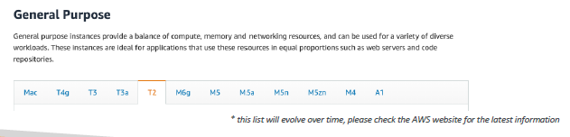

| **Instance Type** | **vCPUs** | **Memory (GiB)** | **Network Performance** | **Storage** |
| ----------------- | --------- | ---------------- | ----------------------- | ----------- |
| **t4g.micro**     | 2         | 1                | Up to 5 Gigabit         | EBS only    |
| **t3.micro**      | 2         | 1                | Up to 5 Gigabit         | EBS only    |
| **m5.large**      | 2         | 8                | Up to 10 Gigabit        | EBS only    |
| **m5.xlarge**     | 4         | 16               | Up to 10 Gigabit        | EBS only    |

#### Compute Optimized Instances

- Great for compute-intensive tasks that require high performance processors:
  - Batch processing workloads
  - Media transcoding
  - High performance web servers
  - High performance computing (HPC)
  - Scientific modeling & machine learning
  - Dedicated gaming servers

  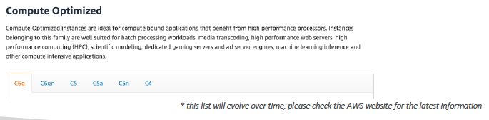

| **Instance Type** | **vCPUs** | **Memory (GiB)** | **Network Performance** | **Storage** |
| ----------------- | --------- | ---------------- | ----------------------- | ----------- |
| **c5.large**      | 2         | 4                | Up to 10 Gigabit        | EBS only    |
| **c5.xlarge**     | 4         | 8                | Up to 10 Gigabit        | EBS only    |
| **c5.2xlarge**    | 8         | 16               | Up to 10 Gigabit        | EBS only    |
| **c5n.9xlarge**   | 36        | 96               | 10 Gigabit              | EBS only    |

#### Memory Optimized Instances

- Fast performance for workloads that process large data sets in memory
- Use cases:
  - High performance, relational/non-relational databases
  - Distributed web scale cache stores
  - In-memory databases optimized for BI (business intelligence)
  - Applications performing real-time processing of big unstructured data

  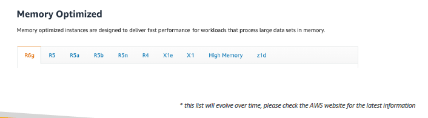

| **Instance Type** | **vCPUs** | **Memory (GiB)** | **Network Performance** | **Storage** |
| ----------------- | --------- | ---------------- | ----------------------- | ----------- |
| **r5.large**      | 2         | 16               | Up to 10 Gigabit        | EBS only    |
| **r5.xlarge**     | 4         | 32               | Up to 10 Gigabit        | EBS only    |
| **r5.4xlarge**    | 16        | 128              | Up to 10 Gigabit        | EBS only    |
| **r5b.12xlarge**  | 48        | 384              | 10 Gigabit              | EBS only    |

#### Storage Optimized Instances

- Great for storage-intensive tasks that require high, sequential read and write access to large data sets on local storage
- Use cases:
  - High frequency online transaction processing (OLTP) systems
  - Relational & NoSQL databases
  - Cache for in-memory databases (for example, Redis)
  - Data warehousing applications
  - Distributed file systems

  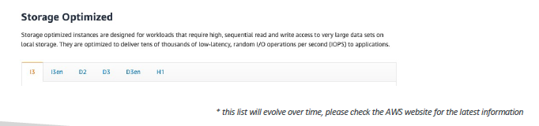

| **Instance Type** | **vCPUs** | **Memory (GiB)** | **Network Performance** | **Storage**         |
| ----------------- | --------- | ---------------- | ----------------------- | ------------------- |
| **i3.large**      | 2         | 15               | Up to 10 Gigabit        | 1 x 475 GB NVMe SSD |
| **i3.xlarge**     | 4         | 30               | Up to 10 Gigabit        | 1 x 950 GB NVMe SSD |
| **i3.2xlarge**    | 8         | 61               | Up to 10 Gigabit        | 1 x 1.9 TB NVMe SSD |
| **d2.8xlarge**    | 36        | 244              | Up to 10 Gigabit        | 12 x 2 TB HDD       |

### EC2 Instance Types: Example

- Here's a quick overview of some example instance types in each category, along with their characteristics:

| **Instance Type** | **vCPUs** | **Memory (GiB)** | **Storage**         | **Network Performance** | **EBS Bandwidth** |
| ----------------- | --------- | ---------------- | ------------------- | ----------------------- | ----------------- |
| **t2.micro**      | 1         | 1                | EBS only            | Low to Moderate         |                   |
| **t2.xlarge**     | 4         | 16               | EBS only            | Moderate                |                   |
| **c5d.4xlarge**   | 16        | 32               | 1*400 NVMe SSD      | Up to 10 Gigabits per second | 4,750 |
| **r5.xlarge**     | 64        | 512              | EBS only            | 20 Gigabits per second | 13,600 |
| **m5.8xlarge**    | 32        | 128              | EBS only            | 10 Gigabits per second | 6,800 |

- t2.micro is part of the AWS free tier (up to 750 hours per month)
- A website to compare all the instances together we can use: https://www.ec2instances.info/

## Introduction to Security Groups

- **Security Groups** are **virtual firewalls** that control inbound and outbound traffic to Amazon EC2 instances.
- Security Groups are the fundamental of network security in AWS
- They control how traffic is allowed into or out of our EC2 Instances.

  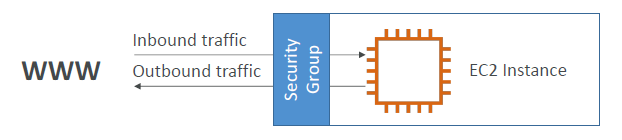

- Security groups only contain **allow** rules
- Security groups rules can reference by IP or by security group
- **Key Features**:
  - By default, all inbound traffic is denied, and all outbound traffic is allowed.
  - You can specify rules based on protocol (TCP, UDP, ICMP), port number, and source IP address or CIDR block.

### Common Use Cases

- Restricting access to an application server (allowing only specific IPs).
- Allowing traffic from specific ports (e.g., HTTP/HTTPS).
- Isolating database instances from public access.

## Security Groups Deeper Dive

- Security groups are acting as a **firewall** on EC2 instances
- They regulate:
  - Access to ports
  - Authorized IP ranges - IPv4 and IPv6
  - Control on **Inbound Network**: Define the traffic allowed into your instances.
  - Control on **Outbound Network**: Define the traffic allowed out from your instances.
- Each rule includes:
  - **Type**: The protocol used (e.g., HTTP, SSH, Custom TCP Rule).
  - **Protocol**: The protocol number (TCP = 6, UDP = 17).
  - **Port Range**: The port(s) affected by the rule.
  - **Source/Destination**: The IP address or CIDR range from which traffic is allowed.

  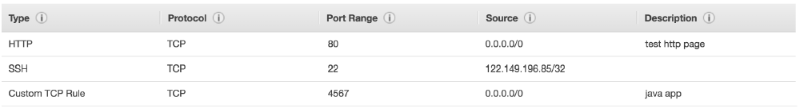

### Security Groups Diagram

- Here we have one security group attached that has inbound and outbound rules. Our computer is authorized on, say, port 22.
- Traffic can go through from our computer to the EC2 instance. Any other computer that's not using my computer IP won't get through the EC2 instance because the firewall is going to block and it will be a timeout.
- For the outbound rules, by default, our EC2 instance security group is going to allow any traffic out of it. If our EC2 instance tries to access a website and initiate a connection, it will be allowed by the security group.

  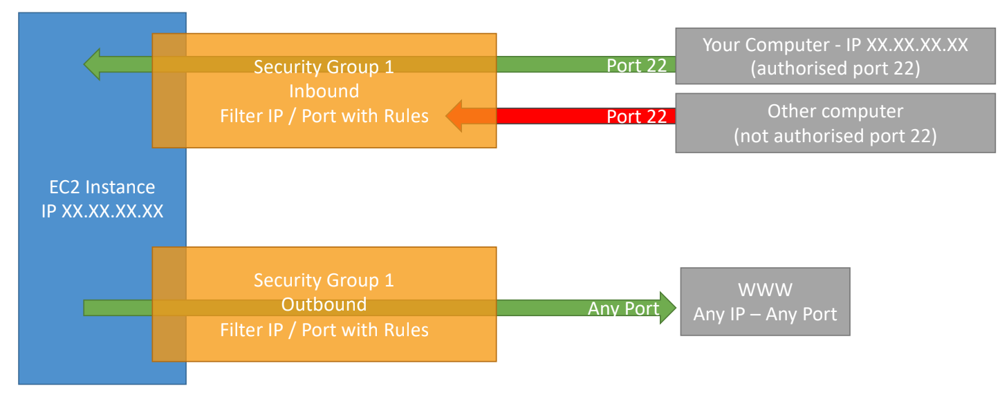

### Examples of Security Group Rules

| **Rule Type** | **Protocol** | **Port Range** | **Source/Destination**      |
| ------------- | ------------ | -------------- | --------------------------- |
| Inbound Rule  | TCP          | 22             | 203.0.113.0/24 (SSH Access) |
| Inbound Rule  | TCP          | 80             | 0.0.0.0/0 (HTTP Access)     |
| Outbound Rule | All Traffic  | All            | 0.0.0.0/0                   |

### Good to Know

- Can be attached to multiple EC2 instances. It is a one-to-one relationship. An instance can have multiple security groups too.
- Locked down to a region / VPC combination. If you switch to another region or create another VPC, then you have to recreate the security groups.
- Does live "outside" the EC2 – if traffic is blocked the EC2 instance won't see it
- It's good to maintain one separate security group for SSH access
- If your application is not accessible (time out), then it's a security group issue
- If your application gives a "connection refused" error, then it's an application error or it's not launched
- All inbound traffic is **blocked** by default
- All outbound traffic is **authorised** by default

## Referencing other security groups diagram

- Here, the inbound rules says, it is authorizing security group 1 and 2.
- When we launch another EC2 instance, and it has security group 2 attached, then we basically allow our EC2 instance to connect straight through the port we decided onto our first EC2 instance.
- Similarly, if we have another EC2 instance with security group 1 attached, we also authorize it to communicate with our instances.
- So, regardless of the IP of our EC2 instances, because they have the right security group attached to them, they are able to communicate straight through to other instances.
- If you have another EC2 instance attached with a security group 3 to it, because security group 3 was not authorized in the inbound rules of security group 1, then it is being denied access to the EC2 instance.

  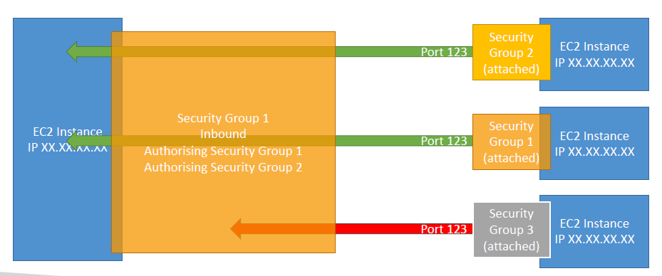

## Classic Ports to Know

| **Port Number** | **Protocol** | **Service** | **Description** |
| --------------- | ------------ | ----------- | --------------- |
| 20              | TCP          | FTP (Data Transfer) | Used for transferring files over FTP. |
| 21              | TCP          | FTP (File Transfer Protocol)  | Upload files into a file share. |
| 22              | TCP          | SSH (Secure Shell)  | Secure Shell for secure logins and command execution. |
| 22              | TCP          | SFTP (Secure File Transfer Protocol) | Upload files using SSH. |
| 80              | TCP          | HTTP                | Hypertext Transfer Protocol for web traffic. |
| 443             | TCP          | HTTPS               | Secure HTTP for secure web traffic. |
| 3389            | TCP          | RDP (Remote Desktop Protocol) | Used for Remote Desktop Protocol, allowing users to connect to and control remote Windows machines. |

## SSH Summary Table

- Based on the OS you may have on our computer, you have different ways to do a secure shell into our servers.
- SSH is a command line utility that can be used on Mac, Linux, as well as over Windows version 10.
- For Windows 10 and earlier, you can use PuTTy. PuTTY will help you do the exact thing as SSH and it is valid for any version of Windows. They help you to use the SSH protocol to connect into your EC2 instances.
- There is something new called EC2 Instance Connect which uses our web browser to connect to your EC2 instances and it is valid for all versions of OS (Mac, Linux, Windows < 10 and Windows >= 10).

  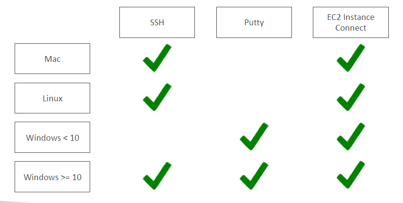

## How to SSH into your EC2 Instance 
### Linux / Mac OS X:

- SSH is one of the most important function. It allows you to control a remote machine, all using the command line.

  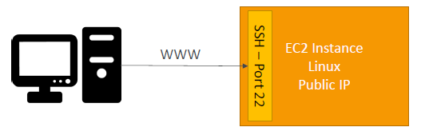

- The Amazon Linux 2 and 3 AMI has a default user `ec2-user` already set up for us.
- Here is the command to SSH into a Linux machine.
- In order to avoid Too many authentication failures, we need to reference the .pem file we downloaded while setting up the Key Pair.

```txt
ssh -i <location/to/your/downloaded/EC2Tutorial.pem/file> ec2-user@<EC2InstancePublicIPAddress>
```

## EC2 Instance Connect

- EC2 Instance Connect is launched on the web browser.

  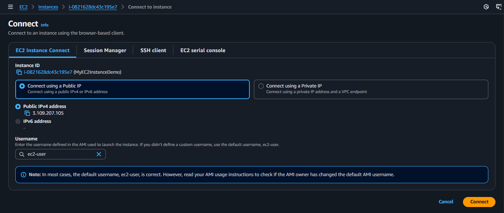

- Once you connect to your instance, you would be able to see a secure shell where you can access the EC2 instance.

  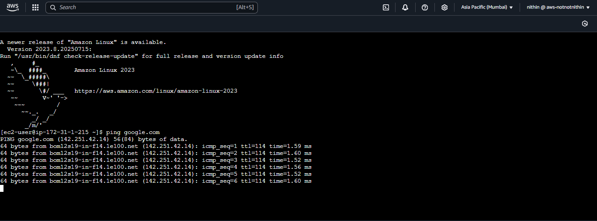

- You can also edit inbound and outbound security group rules. If the rule SSH on port 22 is deleted for some reason, you won't be able to access EC2 instance via the shell.

## EC2 Instance Roles:

- When you are connected to a shell via EC2 Instance Connect, you would want to connect to AWS resources.
- Amazon Linux 2/3 AMIs comes in-built with AWS CLI installed which helps you to access AWS resources from CLI.
- When you do this, you will get `Unable to locate credentials. You can configure credentials by running "aws configure"`.
- We could indeed run `aws configure` to configure the credentials and specify an Access Key ID, Secret Access Key, region and an output form. However, this is a really, really, really a bad idea.
- The reason is that if we run `aws configure` and enter our personal details into an EC2 instance, then anyone else in our account could again connect to our EC2 instance for example, using EC2 Instance Connect and retrieve the value of these credentials in our instance, which is not what we want.
- Instead what we have to do is use IAM roles. We need to attach an IAM role with a proper policy assigned to it, say, IAM Read Only Access, to our EC2 instance to provide it with credentials.
- The effect of this is now, if we run any IAM commands on the command line utility, say `aws iam list-users` we will get a response around the users from IAM without having to run `aws configure` command.

## EC2 Instance Purchasing Options

- [**On Demand Instances**](#on-demand-instance): short workload, predictable pricing, pay by second
- [**Reserved**](#reserved-instances) (1 & 3 years):
  - **Reserved Instances**: long workloads
  - **Convertible Reserved Instances**: long workloads with flexible instances
- [**Savings Plans**](#savings-plans) (1 & 3 years): instead of committing to a specific instance type, we commit to a specific amount of usage, long workload
- [**Spot Instances**](#spot-instances): short workloads, for cheap, can lose instances (less reliable)
- [**Dedicated Hosts**](#dedicated-hosts): book an entire physical server, control instance placement
- [**Dedicated Instances**](#dedicated-instances): no other customers will share your hardware
- [**Capacity Reservations**](#capacity-reservations): reserve capacity in a specific AZ for any duration

### EC2 On Demand:

- Pay for what you use:
  - Linux or Windows - billing per second, after the first minute
  - All other operating systems - billing per hour
- Has the highest cost but no upfront payment
- No long-term commitment
- Recommended for **short-term** and **un-interrupted workloads**, where you can't predict how the application will behave

### EC2 Reserved Instances

- Up to 72% discount compared to On-demand
- You reserve a specific instance attributes **(Instance Type, Region, Tenancy, OS)**
- **Reservation Period – 1 year** (+discount) or **3 years** (+++discount)
- **Payment Options** – **No Upfront** (+), **Partial Upfront** (++), **All Upfront** (+++)
- **Reserved Instance's Scope** – **Regional** or **Zonal** (reserve capacity in an AZ)
- Recommended for steady-state usage applications (think database)
- You can buy and sell in the Reserved Instance Marketplace if you do not need them anymore.

- **Convertible Reserved Instance**:
  - Can change the EC2 instance type, instance family, OS, scope and tenancy
  - Up to 66% discount

### EC2 Savings Plans

- Get a discount based on long-term usage (up to 72% - same as RIs)
- Commit to a certain type of usage ($10/hour for 1 or 3 years)
- Usage beyond EC2 Savings Plans is billed at the On-Demand price
- Locked to a specific instance family & AWS region (e.g., M5 in us-east-1)
- Flexible across:
  - Instance Size (e.g., m5.xlarge, m5.2xlarge)
  - OS (e.g., Linux, Windows)
  - Tenancy (Host, Dedicated, Default)

### EC2 Spot Instances

- Can get a **discount of up to 90%** compared to On-demand
- Instances that you can "lose" at any point of time if your max price is less than the current spot price
- The **MOST cost-efficient** instances in AWS
- **Useful for workloads that are resilient to failure**
  - Batch jobs
  - Data analysis
  - Image processing
  - Any **distributed** workloads
  - Workloads with a flexible start and end time
- **Not suitable for critical jobs or databases**

### EC2 Dedicated Hosts

- A physical server with EC2 instance capacity fully dedicated to your use
- Allows you to address **compliance requirements** and **use your existing server-bound software licenses** (per-socket, per-core, per—VM software licenses)
- Purchasing Options:
  - **On-demand** – pay per second for active Dedicated Host
  - **Reserved** - 1 or 3 years (No Upfront, Partial Upfront, All Upfront)
- The most expensive option
- Useful for software that have complicated licensing model (BYOL – Bring Your Own License)
- Or for companies that have strong regulatory or compliance needs

### EC2 Dedicated Instances

- Instances run on hardware that's dedicated to you
- May share hardware with other instances in same account
- No control over instance placement (can move hardware after Stop / Start)

  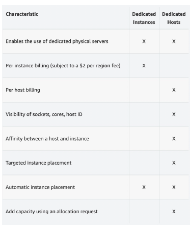

### EC2 Capacity Reservations

- Reserve **On-Demand** instances capacity in a specific AZ for any duration
- You always have access to EC2 capacity when you need it
- **No time commitment** (create/cancel anytime), **no billing discounts**
- Combine with Regional Reserved Instances and Savings Plans to benefit from billing discounts
- You're charged at On-Demand rate whether you run instances or not
- Suitable for short-term, uninterrupted workloads that needs to be in a specific AZ

## Which purchasing option is right for my use case?

- **On-Demand Instances**:
  - Staying at a resort whenever we want and paying the full price for each night.
  - Ideal for a startup running a web application with unpredictable traffic spikes.
- **Reserved Instances**:
  - Planning a long vacation in advance, allowing us to get a significant discount for booking ahead.
  - Best for a company operating a database server that requires constant uptime for a year.
- **Savings Plans**:
  - Committing to a set amount per hour for a specified duration while enjoying any room type (e.g., King, Suite, SeaView, etc..)
  - Suitable for a SaaS provider that anticipates steady usage of compute resources over three years.
- **Spot Instances**:
  - Bidding for available rooms; the highest bidder secures the room, but they can be asked to leave at any moment.
  - Perfect for a research team processing large data sets where jobs can be paused and resumed.
- **Dedicated Hosts**:
  - Renting an entire wing of the resort exclusively for ourselves.
  - Appropriate for a financial institution needing to comply with strict regulatory requirements and using custom software licenses.
- **Dedicated Instances**:
  - Having a private room that's solely ours but sharing some amenities with other guests.
  - Great for a business running non-critical applications that need some level of hardware isolation.
- **Capacity Reservations**:
  - Booking a room for a set period at full price, even if we don't end up using it.
  - Useful for an enterprise ensuring EC2 capacity for a new product launch in a specific availability zone.

### EC2 Instance Launch Types Comparison

| **Launch Type**           | **Cost Structure**                                                                  | **Payment Options**                                    | **Commitment**                | **Use Case**                                                 | **Flexibility**                                                          |
| ------------------------- | ----------------------------------------------------------------------------------- | ------------------------------------------------------ | ----------------------------- | ------------------------------------------------------------ | ------------------------------------------------------------------------ |
| **On-Demand Instances**   | - Linux/Windows: per second after the first minute <br> - Other OS: billed per hour | No upfront payment                                     | No long-term commitment       | Short-term and unpredictable workloads                       | High flexibility; can start/stop anytime                                 |
| **Reserved Instances**    | Up to 72% discount compared to On-Demand                                            | - No Upfront <br> - Partial Upfront <br> - All Upfront | 1 year or 3 years             | Steady-state applications (e.g., databases)                  | Reserved capacity in a specific region or AZ                             |
| **Savings Plans**         | Up to 72% discount based on long-term usage                                         | Commit to a certain usage amount                       | 1 year or 3 years             | Applications with predictable usage patterns                 | Flexible across instance size, OS, and tenancy                           |
| **Spot Instances**        | Discount up to 90% compared to On-Demand                                            | Pay the Spot price                                     | No commitment required        | Cost-sensitive, resilient workloads (e.g., batch jobs)       | Instances can be terminated anytime if spot price exceeds your max price |
| **Dedicated Hosts**       | Most expensive; pay per second for active host                                      | - On-Demand <br> - Reserved (1 or 3 years)             | Long-term commitment possible | Compliance-heavy applications or complex licensing models    | Full control over server; ideal for BYOL scenarios                       |
| **Dedicated Instances**   | Higher than shared instances; not the most expensive                                | On-Demand pricing                                      | No long-term commitment       | Workloads needing dedicated hardware but can share resources | Limited control over instance placement                                  |
| **Capacity Reservations** | Billed at On-Demand rates regardless of instance running                            | No upfront payment                                     | No time commitment            | Ensures EC2 capacity availability in a specific AZ           | Can create/cancel anytime; no discounts on billing                       |

## Price Comparison Example – m4.large – us-east-1

| **Launch Type**           | **Hourly Price**                     | **Monthly Price (Approx.)** | **Notes**                                                        |
| ------------------------- | ------------------------------------ | --------------------------- | ---------------------------------------------------------------- |
| **On-Demand Instance**    | $0.096 per hour                      | $69.12                      | Pay-as-you-go pricing. Ideal for short-term usage.               |
| **Reserved Instances**    | $0.054 per hour (1-year term)        | $39.24                      | Commit to one year for a significant discount.                   |
| **Savings Plans**         | $0.058 per hour (1-year term)        | $41.76                      | Flexible savings plan applicable to any instance type.           |
| **Spot Instances**        | $0.028 per hour (varies with demand) | $20.16                      | Pricing varies; can be interrupted. Best for flexible workloads. |
| **Dedicated Hosts**       | $0.12 per hour (per host)            | $86.40                      | Dedicated physical server; pricing per host.                     |
| **Dedicated Instances**   | $0.096 per hour                      | $69.12                      | Similar to on-demand but on dedicated hardware.                  |
| **Capacity Reservations** | $0.096 per hour                      | $69.12                      | Reserved capacity at on-demand pricing.                          |

##  AWS charges for IPv4 addresses

- Starting February 1st 2024, there's a charge for all public IPv4 created in your account whether or not they are being used.
- $0.005 per hour of public IPv4 (~$3.6 per month)
- For new accounts in AWS, you have a free tier for the EC2 service: 750 hours of public IPv4 per month for the first 12 months
- For all other services there is no free tier
- When we create an EC2 instance, we try to connect to it, so we will have a public IP. This is free until 750 hours per month of usage. 
- If you create a second EC2 instance, you create a public IP for that as well. Again, this goes towards the 750 hours per month free tier. As long as the public IP usage is less than 750 hours per month, you stay under the free tier.
- If you go over 750 hours per month and you have 4 public IPv4 at the same time, you are going to pay for all of them after the free tier.
- When we create load balancers, then you may have one public IPv4 per AZ. If you launch 3 load balancers, you will have 3 public IPv4. Here, you do not have a free tier and so you will have charges incurred whil using a load balancer.
- For an Amazon RDS database, when you create and want to connect to it from your public computer, you will create a public IPv4 address, and there is no free tier and you will have charges around it. 

  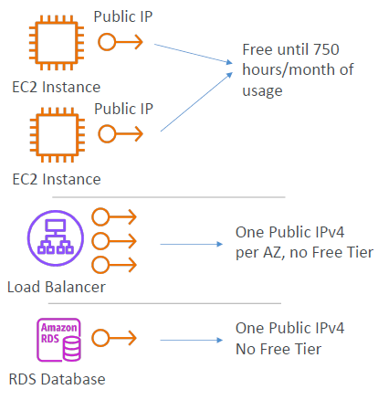

- What about IPv6?
  - The whole idea behind these charges for AWS is that they are trying to migrate everything to IPv6, where it is a bit easier to have them at scale.
  - However, many internet providers around the world do not support IPv6 yet.
- If you want to see your IP addresses:
  - you can do so by going to **IPAM (Amazon VPC IP Address Manager)** and you can monitor all your IP addresses in your account and get some information under **Public IP Insights**.
  - Nice article here: https://repost.aws/articles/ARknH_OR0cTvqoTfJrVGaB8A/why-am-i-seeingcharges-
for-public-ipv4-addresses-when-i-am-under-the-aws-free-tier

## EC2 Spot Instance Requests

* Can get a discount of up to 90% compared to On-demand
* How does that work? We define a **max spot price** that we're willing to pay for that spot instance. As long as the instance is having a **spot price < the max price we're willing to pay**, then we keep that instance.
  * The hourly spot price varies based on offer and capacity.
  * And if somehow the **current spot price > your max price you have defined**, then you have two options. For these two options, you have a two minutes grace period. That gives you a little bit of time to do these things. The options can be either you're stopping your instance, that means that you shut down everything you are doing then you stop your instance. And, if one day the spot price goes below your max price, then you can restart your instance and continue where you left it off or if you don't need the state on your EC2 instance, you can just choose to terminate your instance and let it go. And then that would assume that anytime you would restart your work, you can start with a fresh new EC2 instance
* Other strategy: **Spot Block**
  * If you don't want your spot instance to be reclaimed by AWS, you can use a spot block. And the spot block is when you block a spot instance for a specified timeframe. This can be between 1 to 6 hours, and you get that block without any interruption, at least on paper because in the documentation-- but it's really rare "block" spot instance during a specified time frame (1 to 6 hours) without interruptions.
  * In rare situations, the instance may be reclaimed but overall, when you consider a spot block the instance will not be reclaimed, that's the whole purpose of the spot block.
* **Used for batch jobs, data analysis, or workloads that are resilient to failures.**
* **Not great for critical jobs or databases.**

## EC2 Spot Instances Pricing

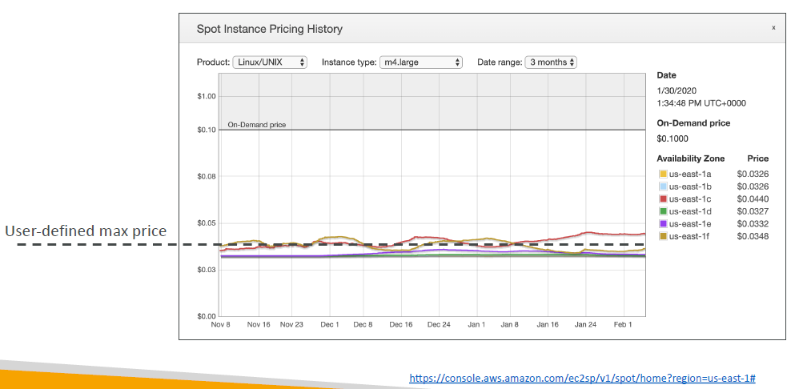

* This is a graph that is obtained directly from the AWS console. As you can see, this gives us the price for a m4 large instance over three months in the spot zone. So, you have six lines for us-east-1.
* You have six AZs. So, 6 prices. So, the spot price does vary based on the AZ you are considering.
* As you can see, over three months it has varied quite a bit. For example, if you look at that yellow line, it has varied between 0.4 to 0.45, all the way down to almost 0.35 let's say, and so on.
* Let's assume that you are defining a user defined max price to be this black horizontal bar/dotted line. What you would see is that if the yellow line is above the dotted line, then the current spot price is going to be more than the max price you have defined. In this instance, you are going to lose our spot instance, you have to terminate it or stop it but if the price goes down, that is, if the yellow line goes down our dotted line, that means that you are willing to pay that price. So, you are gaining that spot instance in this meantime. This is how you can optimize the cost of our workload very easily.
* As you can see, the On-Demand price is $0.10 per hour. That's really, really cheap and then the spot instance price is even cheaper. It is around $0.4. It is a 60% saving in that instance for the spot instance pricing. Lots of savings. 
* Obviously if you were to define your user defined max price to be something like $0.05 per hour, then no spot instances will be reclaimed because you are always willing to pay more than the actual spot instance price. So, no one can predict how the price goes over time, but as you can see, it can be rather stable, it can fluctuate a little bit but overall, it still provides you huge savings compared to On-Demand.

## How to terminate Spot Instances?

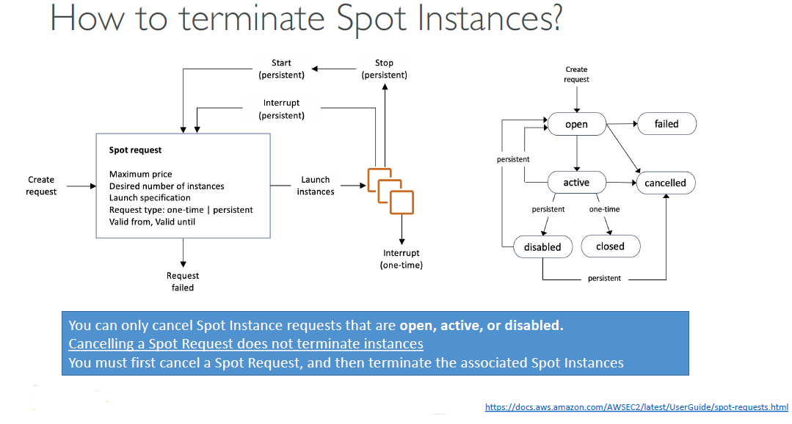

* How do you terminate a spot instance? We have to first understand how a spot request works. For this, let's consider a spot request. With the spot request, you are defining: 
  * the number of instances you want
  * the maximum price you are going to pay
  * the launch specification
  * the AMI and so on
  * when your request is valid from and until, but it can be infinite, and 
  * the request type. 
* It is very important to understand there are two types of requests:
  * **One-Time Request:** If it is a one-time request, as soon as your spot request is fulfilled, your instances are going to be launched and then your spot request will go away because it was a one-time request type. In this case, your spot request is going to go away and you are fine. 
  * **Persistent Request:** that means that we want this number of instances to be valid as long as the spot request is valid from to valid until. That means if somehow your instances do get stopped or interrupted based on the spot price, then your spot request will go back into action and when things can be validated, we will restart spot instances for you. If somehow you stop a spot instance in persistent mode and your spot request is still active, your spot request automatically will be smart enough to restart a launch and instance for you. This is something you can also see in this diagram but I won't spend too much time on it. What you understand out of this is if you want to cancel a spot request, it needs to be in the open state, the active state, or the disabled state. Basically, it is not failed, it is not canceled, or it is not closed. 
* When you want to cancel a spot request, it is not going to terminate any instances that you have launched from before. It is still your responsibility to terminate these instances and not the responsibility of AWS. 
* So as such, if you want to terminate spot instances for good and not have them relaunch, you need to first cancel the spot request, then you terminate the associated spot instances. Because if you were to terminate the spot instances first, remember it goes back into the spot request and the spot request says, "Okay, you wanted six instances, but I can see you have zero right now. So, I am going to launch six instances for you." Again, the right order to cancel and to terminate spot instances is to first cancel the spot request to make sure that no new instances will be launched by AWS and then you terminate the associated spot instances. 

## Spot Fleets

* This is the ultimate way to save money. This is a way to define for you to get a set of spot instances and optionally On-Demand Instances, that is why it is called a **fleet**. 
* The spot fleet will try its best to meet the target capacity with the price constraints you defined.
  * It will launch from possible launch pools. It can have different instance types, different OS, and availability zones. You're going to define multiple launch pools, multiple instance types, multiple everything. 
  * Then the fleet will choose the best and most appropriate launch pool for you. 
  * When your spot fleet either reaches your budget or reaches the capacity you wanted, then it will stop launching instances. 
* You define a strategy to allocate spot instances in your spot fleet, and that is something to remember. 
  * **lowest price**: This is going to the most popular one going into the exam, which is that the spot fleet will launch instances from the pool that has the lowest price and that gives you a lot of cost optimization and this is a **great option if you have a very short workload**.
  * **diversified**: In this case, the launch in the spot instances will be distributed across all the pools that you have defined from before, which is **great for availability and long workloads** because if one pool goes away, then your other pools are still active.
  * **capacity optimized**: You have a pool with the optimal capacity for the number of instances you want. 
  * **price capacity optimized**: which is first choosing the pool with the highest capacity available and then select within that, the one that has the lowest price, which is the best choice for most workloads. 
* The idea is that spot fleets can be complicated, but what you have to remember is that using the spot fleet, you're able to define multiple launch pools and multiple instance types until you're just interesting in raw power. Then if you use the lowest price discounts or the lowest price strategy for spot fleets, then the spot fleets will automatically request the spot instances with the lowest price for us. Spot fleets gives us an extra saving based on spot instances because it is smart enough to choose the right spot instance pool to allow us to get the maximum amount of savings. This is the benefits of spot fleets. Again, you need to understand the difference here of doing a very simple spot instance request where you know exactly the type of instance you want and the AZ you want to using a spot fleet and saying, "Okay, you can choose all these instance types in all these AZ, and what I need from you is to give me the lowest price". This gives you a lot of insights into how spot fleets and spot instances are different.

## Shared Responsibility Model for EC2

| **Responsibility** | **AWS Responsibilities** | **User Responsibilities** |
| ------------------ | ------------------------ | ------------------------- |
| **Infrastructure Security** | The security of the underlying infrastructure, including hardware, software, networking, and facilities. | Securing the EC2 instances, including operating systems and applications. |
| **Physical Security**       | Ensures physical security of data centers where EC2 instances run. | N/A |
| **Network Security**        | Implements security measures for the network, including firewalls and DDoS protection. | Configuring security groups, network ACLs, and VPC settings. |
| **Data Protection** | Provides encryption options for data at rest and in transit. | Managing data encryption and access control. |
| **Access Management** | Offers IAM services to manage access to AWS resources. | Configuring IAM users, roles, and policies for access management. |
| **Compliance** | Complies with various compliance standards and certifications for infrastructure. | Compliance related to the applications and data hosted on EC2 instances. |
| **Patch Management** | Provides a secure and up-to-date infrastructure. | Applying patches and updates to the operating system and applications. |

## EC2 Section – Summary

- **EC2 Instance:** AMI (OS) + Instance Size (CPU + RAM) + Storage + security groups + EC2 User Data
- **Security Groups:** Firewall attached to the EC2 instance
- **EC2 User Data:** Script launched at the first start of an instance
- **SSH:** start a terminal into our EC2 Instances (port 22)
- **EC2 Instance Role:** link to IAM roles
- **Purchasing Options:** On-Demand, Spot, Reserved (Standard + Convertible), Savings, Dedicated Host, Dedicated Instance, Capacity Reservations.