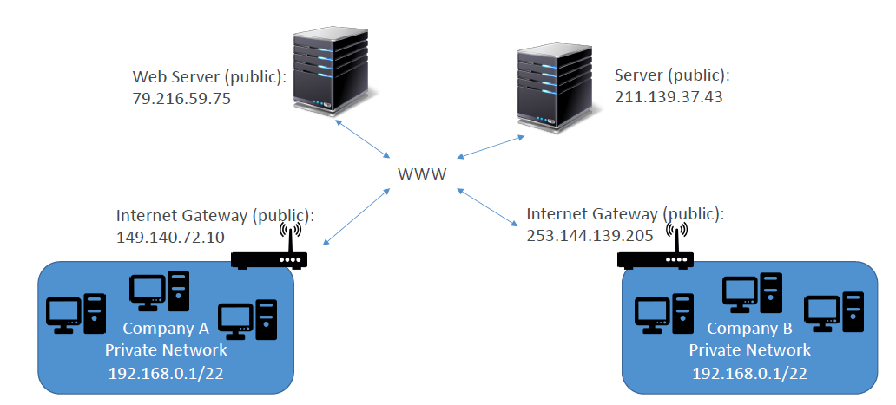
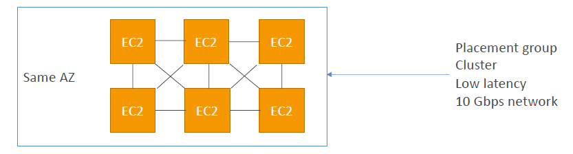
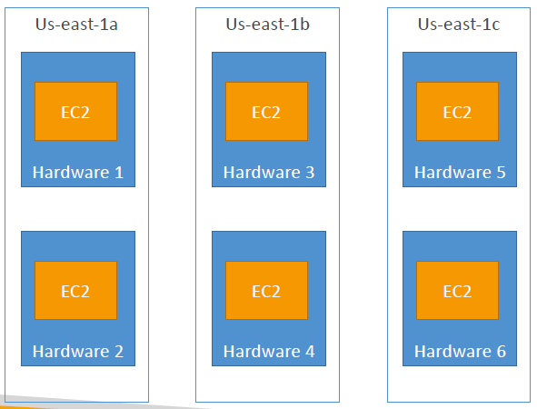
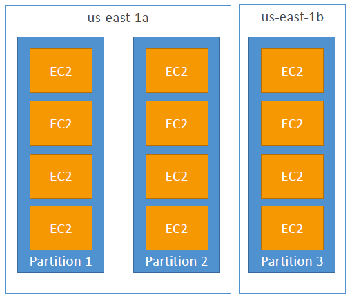
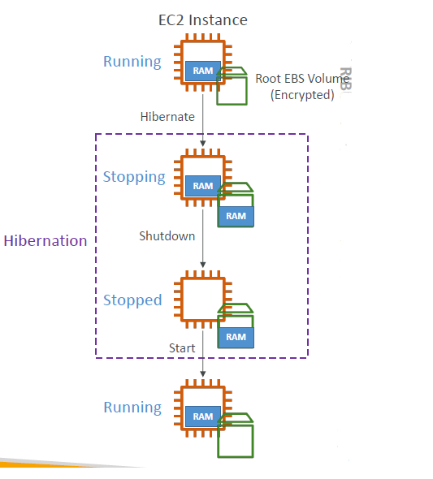

# EC2: Solutions Architect Associate Level

- [EC2: Solutions Architect Associate Level](#ec2-solutions-architect-associate-level)
	- [Private IP vs Public IP (IPv4) vs Elastic IP](#private-ip-vs-public-ip-ipv4-vs-elastic-ip)
	- [Private vs Public IP (IPv4)](#private-vs-public-ip-ipv4)
		- [Example:](#example)
	- [Private vs Public IP (IPv4)](#private-vs-public-ip-ipv4-1)
		- [Fundamental Differences:](#fundamental-differences)
	- [Elastic IPs](#elastic-ips)
	- [Elastic IP](#elastic-ip)
	- [Private vs Public IP (IPv4)](#private-vs-public-ip-ipv4-2)
		- [In AWS EC2 – Hands On](#in-aws-ec2--hands-on)
	- [Placement Groups](#placement-groups)
	- [Placement Groups](#placement-groups-1)
		- [Cluster](#cluster)
	- [Placement Groups](#placement-groups-2)
		- [Spread](#spread)
	- [Placements Groups](#placements-groups)
		- [Partition](#partition)
	- [Elastic Network Interfaces (ENI)](#elastic-network-interfaces-eni)
	- [EC2 Hibernate](#ec2-hibernate)
	- [EC2 Hibernate – Good to know](#ec2-hibernate--good-to-know)

## Private IP vs Public IP (IPv4) vs Elastic IP

* Networking has two sorts of IPs. IPv4 and IPv6:
	* IPv4: 1.160.10.240
	* IPv6: 3ffe:1900:4545:3:200:f8ff:fe21:67cf
* **In this course, we will only be using IPv4.**
* IPv4 is still the most common format used online.
* IPv6 is newer and solves problems for the Internet of Things (IoT).
* IPv4 allows for 3.7 billion different addresses in the public space.
* IPv4: [0-255].[0-255].[0-255].[0-255].

## Private vs Public IP (IPv4)
### Example:

## Private vs Public IP (IPv4)
### Fundamental Differences:

* **Public IP:**
  * Public IP means the machine can be identified on the internet (WWW).
  * Must be unique across the whole web (not two machines can have the same public IP).
  * Can be geo-located easily.
* **Private IP:**
  * Private IP means the machine can only be identified on a private network only.
  * The IP must be unique across the private network.
  * BUT two different private networks (two companies) can have the same IPs.
  * Machines connect to WWW using a NAT + internet gateway (a proxy).
  * Only a specified range of IPs can be used as private IP.

## Elastic IPs

* When you stop and then start an EC2 instance, it can change its public IP.
* If you need to have a fixed public IP for your instance, you need an Elastic IP.
* An Elastic IP is a public IPv4 IP you own as long as you don’t delete it.
* You can attach it to one instance at a time.

## Elastic IP

* With an Elastic IP address, you can mask the failure of an instance or software by rapidly remapping the address to another instance in your account.
* You can only have 5 Elastic IP in your account (you can ask AWS to increase that).
* Overall, **try to avoid using Elastic IP:**
  * They often reflect poor architectural decisions
  * Instead, use a random public IP and register a DNS name to it
  * Or, as we’ll see later, use a Load Balancer and don’t use a public IP

## Private vs Public IP (IPv4)
### In AWS EC2 – Hands On

* By default, your EC2 machine comes with:
	* A private IP for the internal AWS Network.
	* A public IP, for the WWW.
* When we are doing SSH into our EC2 machines:
	* We can’t use a private IP, because we are not in the same network.
	* We can only use the public IP.
* If your machine is stopped and then started, **the public IP can change.**

## Placement Groups
* Sometimes you want control over the EC2 Instance placement strategy
* That strategy can be defined using placement groups
* When you create a placement group, you specify one of the following strategies for the group:
  * **Cluster:** clusters instances into a low-latency group in a single Availability Zone
  * **Spread:** spreads instances across underlying hardware (max 7 instances per group per AZ)
  * **Partition:** — spreads instances across many different partitions (which rely on different sets of racks) within an AZ. Scales to 100s of EC2 instances per group (Hadoop, Cassandra, Kafka)

## Placement Groups
### Cluster

* **Pros:** Great network (10 Gbps bandwidth between instances with Enhanced Networking enabled - recommended).
* **Cons:** If the AZ fails, all instances fails at the same time.
* **Use case:**
  * Big Data job that needs to complete fast.
  * Application that needs extremely low latency and high network throughput.

## Placement Groups
### Spread

* **Pros:**
	* Can span across Availability Zones (AZ).
	* Reduced risk is simultaneous failure.
	* EC2 Instances are on different physical hardware.
* **Cons:**
	* Limited to 7 instances per AZ per placement group.
* **Use case:**
	* Application that needs to maximize high availability.
	* Critical Applications where each instance must be isolated from failure from each other.

## Placements Groups
### Partition

* Up to 7 partitions per AZ
* Can span across multiple AZs in the same region
* Up to 100s of EC2 instances
* The instances in a partition do not share racks with the instances in the other partitions
* A partition failure can affect many EC2 but won’t affect other partitions
* EC2 instances get access to the partition information as metadata
* **Use cases:** HDFS, HBase, Cassandra, Kafka

## Elastic Network Interfaces (ENI)

* Logical component in a VPC that represents a **virtual network card**
* The ENI can have the following attributes:
	* Primary private IPv4, one or more secondary IPv4
	* One Elastic IP (IPv4) per private IPv4
	* One Public IPv4
	* One or more security groups
	* A MAC address
* You can create ENI independently and attach them on the fly (move them) on EC2 instances for failover
* Bound to a specific availability zone (AZ) EC2

## EC2 Hibernate

* We know we can stop, terminate instances.
	* **Stop** – the data on disk (EBS) is kept intact in the next start.
	* **Terminate** – any EBS volumes (root) also set-up to be destroyed is lost.
* On start, the following happens:
	* First start: the OS boots & the EC2 User Data script is run.
	* Following starts: the OS boots up.
	* Then your application starts, caches get warmed up, and that can take time!

## EC2 Hibernate – Good to know

* **Supported Instance Families:** C3, C4, C5, I3, M3, M4, R3, R4, T2, T3, ...
* **Instance RAM Size:** must be less than 150 GB.
* **Instance Size:** not supported for bare metal instances.
* **AMI:** Amazon Linux 2, Linux AMI, Ubuntu, RHEL, CentOS & Windows...
* **Root Volume:** must be EBS, encrypted, not instance store, and large.
* Available for **On-Demand, Reserved and Spot Instances**
* An instance can **NOT** be hibernated more than 60 days.