# Amazon EC2 – Instance Storage

- [Amazon EC2 – Instance Storage](#amazon-ec2--instance-storage)
	- [EBS Volumes](#ebs-volumes)
		- [What’s an EBS Volume?](#whats-an-ebs-volume)
		- [EBS Volume](#ebs-volume)
		- [EBS Volume - Example](#ebs-volume---example)
		- [EBS – Delete on Termination Attribute](#ebs--delete-on-termination-attribute)
		- [EBS Snapshots](#ebs-snapshots)
		- [EBS Snapshots Features](#ebs-snapshots-features)
	- [AMI Overview](#ami-overview)
		- [AMI Process (from an EC2 instance)](#ami-process-from-an-ec2-instance)
	- [EC2 Instance Store](#ec2-instance-store)
		- [Local EC2 Instance Store](#local-ec2-instance-store)
		- [EBS Volume Types](#ebs-volume-types)
		- [EBS Volume Types Use cases](#ebs-volume-types-use-cases)
			- [General Purpose SSD](#general-purpose-ssd)
		- [EBS Volume Types Use cases](#ebs-volume-types-use-cases-1)
			- [Provisioned IOPS (PIOPS) SSD](#provisioned-iops-piops-ssd)
		- [EBS Volume Types Use cases](#ebs-volume-types-use-cases-2)
			- [Hard Disk Drives (HDD)](#hard-disk-drives-hdd)
		- [EBS – Volume Types Summary](#ebs--volume-types-summary)
		- [EBS Multi-Attach – io1/io2 family](#ebs-multi-attach--io1io2-family)
		- [EBS Encryption](#ebs-encryption)
		- [Encryption: encrypt an unencrypted EBS volume](#encryption-encrypt-an-unencrypted-ebs-volume)
	- [EFS: Elastic File System](#efs-elastic-file-system)
		- [EFS – Performance \& Storage Classes](#efs--performance--storage-classes)
		- [EFS – Storage Classes](#efs--storage-classes)
		- [EBS vs EFS – Elastic Block Storage](#ebs-vs-efs--elastic-block-storage)
		- [EBS vs EFS – Elastic File System](#ebs-vs-efs--elastic-file-system)

## EBS Volumes

- AWS official Doc. <https://docs.aws.amazon.com/ebs/latest/userguide/ebs-volumes.html>

### What’s an EBS Volume?

* An **EBS (Elastic Block Store) Volume** is a **network** drive you can attach to your instances while they run
* It allows your instances to persist data, even after their termination
* **They can only be mounted to one instance at a time** (at the CCP level)
* They are bound to **a specific availability zone**
* **Analogy:** Think of them as a "network USB stick"
* **Free tier:** 30 GB of free EBS storage of type General Purpose (SSD) or Magnetic per month

### EBS Volume
* It's a network drive (i.e. not a physical drive)
	* It uses the network to communicate the instance, which means there might be a bit of latency
	* It can be detached from an EC2 instance and attached to another one quickly
* It's locked to an Availability Zone (AZ)
	* An EBS Volume in us-east-1a cannot be attached to us-east-1b
	* To move a volume across, you first need to snapshot it
* Have a provisioned capacity (size in GBs, and IOPS)
	* You get billed for all the provisioned capacity
	* You can increase the capacity of the drive over time

### EBS Volume - Example

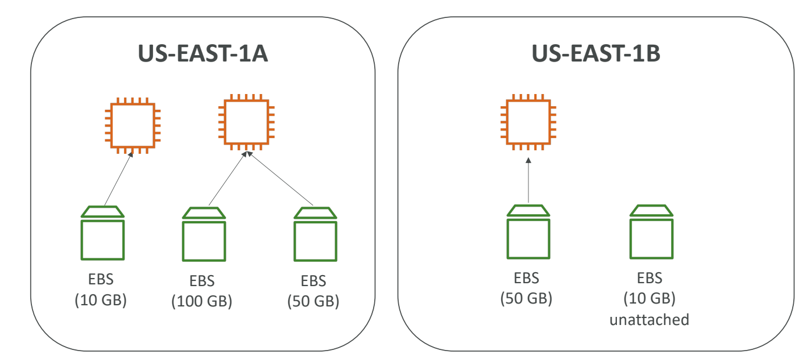

* It's a network drive (i.e. not a physical drive)
  * It uses the network to communicate the instance, which means there might be a bit of latency
  * It can be detached from an EC2 instance and attached to another one quickly becasue they are a network drive
* It's locked to an Availability Zone (AZ)
  * An EBS Volume in us-east-1a cannot be attached to us-east-1b
  * To move a volume across different AZs, you first need to snapshot it
* Have a provisioned capacity (size in GBs, and IOPS) in advance. You need to say how many GBs you want in advance and the IOPS, which is I/O operations per seconds, and you're basically defining how you want your EBS volumes to perform.
  * You get billed for all the provisioned capacity
  * You can increase the capacity of the drive over time if you want to have a better performance or more size.
* As it is evident from the below diagram, we cannot attach the same EBS volume to two EC2 instances at a time at the CCP level. 
* However, it is very possible to have two EBS volumes attached to one EC2 instance. Think of it as two network USB sticks into one machine.
* EBS volumes are linked to an availability zone. If you want EBS volumes in other AZs then in that case you need to create EBS volumes in the other AZ.
* It is possible to create an EBS Volume and leave them unattached and can be attached on demand.

### EBS – Delete on Termination Attribute

  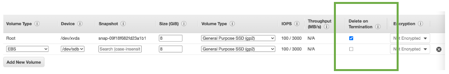

* Controls whether the EBS volume is automatically deleted when the associated EC2 instance is terminated
  * By default, the root EBS volume is deleted (attribute enabled)
  * By default, any other attached EBS volume is not deleted (attribute disabled)
* This can be controlled by the AWS console / AWS CLI
* **Use case: preserve root volume when instance is terminated**

### EBS Snapshots

- Make a backup (snapshot) of your EBS volume at a point in time. You will be able to back up the state of it and even if the EBS Volume is terminated later on, you could restore it from that backup
- Not necessary to detach volume from an EC2 intance to do snapshot, but recommended for data integrity purposes
- Can copy snapshots across AZ or Region
- The EBS Volume is attached to your EC2 instance in region, say us-east-1a, and then we would snapshot it. Now, the EBS Snapshot exist in your region and that EBS Volume can be used to restore a new EBS Volume in another availability zone, say us-east-1b

  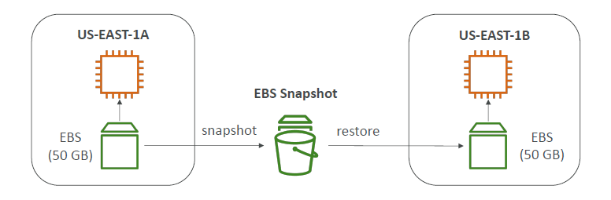

### EBS Snapshots Features

- **EBS Snapshot Archive**
  - Move a Snapshot to an "archive tier" that is 75% cheaper
  - Takes within 24 to 72 hours for restoring the archive
  
  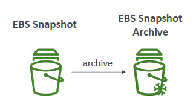

- **Recycle Bin for EBS Snapshots**
  - Setup rules to retain deleted snapshots so you can recover them after an accidental deletion
  - Specify retention (from 1 day to 1 year)

  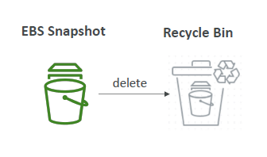

## AMI Overview

- AMI = Amazon Machine Image
- AMI is what powers our EC2 instances
- AMI are a **customization** of an EC2 instance
  - In it you may add your own software, configuration, operating system, monitoring...
  - If we create your own AMI, we are going to get a faster boot / configuration time because all your software is pre-packaged through the AMI
- AMI are built for a **specific region** (and can be copied across regions)
- You can launch EC2 instances from:
  - **A Public AMI:** AWS provided
  - **Your own AMI:** you make and maintain them yourself
  - **An AWS Marketplace AMI:** an AMI someone else made (and potentially sells)

### AMI Process (from an EC2 instance)

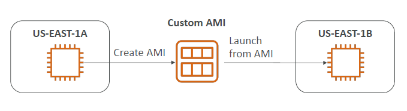

- Start an EC2 instance and customize it by installing some software
- Stop the instance (for data integrity)
- Build an AMI – this will also create EBS snapshots
- Launch instances from other AMIs

## EC2 Instance Store

* EBS volumes are **network drives** with good but "limited" performance
* If you need a high-performance hardware disk attached onto your real hardware server (EC2 instance), then use EC2 Instance Store
* Better I/O performance, better throughput.
* But the caveat is when you stop your EC2 Instance having an Instance Store lose, then the storage will be lost. Therefore, it is called an ephemeral storage. Meaning EC2 Instance Store cannot be used as a durable long term place to store your data
* **Use Case:** Good for buffer / cache / scratch data / temporary content
* In case the underlying server fails, then you will risk to have a data loss because the hardware attached to the EC2 instance will fail as well.
* Hence backups and replication will be your responsibility

### Local EC2 Instance Store

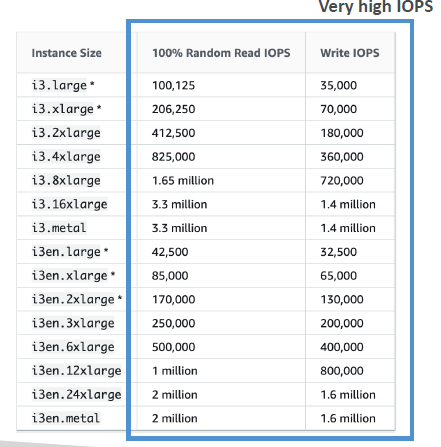

* As you can see the read IOPS and the write IOPS which correspond to how many I/O operations we can do per second, then you can see that some of these random read IOPS and write IOPS can reach 3.3 million or 1.4 million for the most performant one.
* To put this comparison with EBS Volume of type GP2 for example, you can reach 32000 IOPS which when compared to EC2 Instance Store is very less.

### EBS Volume Types

* EBS Volumes come in 6 types
	* **gp2 / gp3 (SSD):** General purpose SSD volume that balances price and performance for a wide variety of workloads.
	* **io1 / io2 Block Express (SSD):** Highest-performance SSD volume for mission-critical low-latency or high-throughput workloads.
	* **st1 (HDD):** Low cost HDD volume designed for frequently accessed, throughput intensive workloads.
	* **sc1 (HDD):** Lowest cost HDD volume designed for less frequently accessed workloads.
* EBS Volumes are characterized in Size | Throughput | IOPS (I/O Ops Per Sec)
* When in doubt always consult the AWS documentation – it's good!
* **Only gp2/gp3 and io1/io2 Block Express can be used as boot volumes**

### EBS Volume Types Use cases
#### General Purpose SSD

* Cost effective storage, low-latency
* System boot volumes, Virtual desktops, Development and test environments
* 1 GiB - 16 TiB
* **gp3:**
  * Baseline of 3,000 IOPS and throughput of 125 MiB/s
  * Can increase IOPS up to 16,000 and throughput up to 1000 MiB/s independently
* **gp2:**
  * Small gp2 volumes can burst IOPS to 3,000
  * Size of the volume and IOPS are linked, max IOPS is 16,000
  * 3 IOPS per GB, means at 5,334 GB we are at the max IOPS

### EBS Volume Types Use cases
#### Provisioned IOPS (PIOPS) SSD

* Critical business applications with sustained IOPS performance
* Or applications that need more than 16,000 IOPS
* Great for **databases workloads** (sensitive to storage perf and consistency)
* **io1 (4 GiB - 16 TiB):**
  * Max PIOPS: 64,000 for Nitro EC2 instances & 32,000 for other
  * Can increase PIOPS independently from storage size
* **io2 Block Express (4 GiB – 64 TiB):**
  * Sub-millisecond latency
  * Max PIOPS: 256,000 with an IOPS:GiB ratio of 1,000:1
* Supports EBS Multi-attach

### EBS Volume Types Use cases
#### Hard Disk Drives (HDD)
* Cannot be a boot volume
* 125 GiB to 16 TiB
* **Throughput Optimized HDD (st1)**
	* Big Data, Data Warehouses, Log Processing
	* **Max throughput** 500 MiB/s – max IOPS 500
* **Cold HDD (sc1):**
	* For data that is infrequently accessed
	* Scenarios where lowest cost is important
	* **Max throughput** 250 MiB/s – max IOPS 250

### EBS – Volume Types Summary

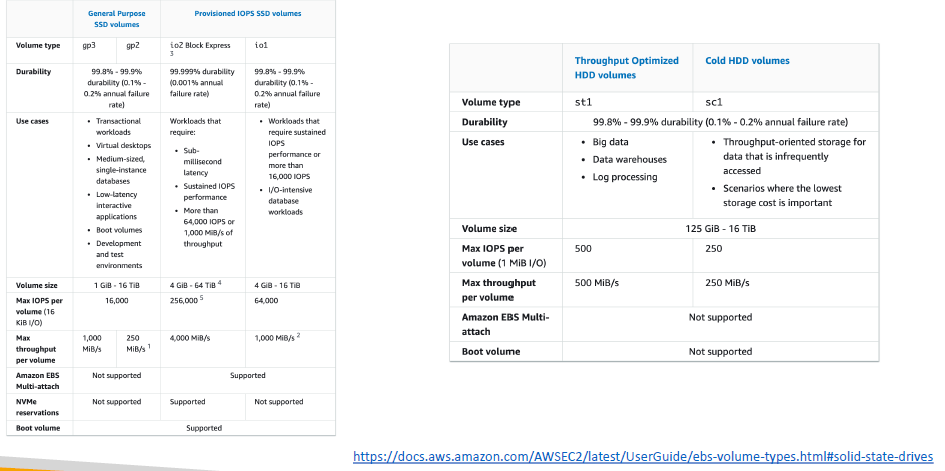

### EBS Multi-Attach – io1/io2 family

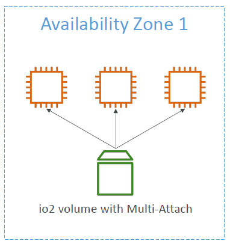

* Attach the same EBS volume to multiple EC2 instances in the same AZ
* Each instance has full read & write permissions to the high-performance volume
* **Use case:**
	* Achieve **higher application availability** in clustered Linux applications (ex: Teradata)
	* Applications must manage concurrent write operations
* **Up to 16 EC2 Instances at a time**
* Must use a file system that's cluster-aware (not XFS, EXT4, etc...)

### EBS Encryption

* When you create an encrypted EBS volume, you get the following:
	* Data at rest is encrypted inside the volume
	* All the data in flight moving between the instance and the volume is encrypted
	* All snapshots are encrypted
	* All volumes created from the snapshot
* Encryption and decryption are handled transparently (you have nothing to do)
* Encryption has a minimal impact on latency
* EBS Encryption leverages keys from KMS (AES-256)
* Copying an unencrypted snapshot allows encryption
* Snapshots of encrypted volumes are encrypted

### Encryption: encrypt an unencrypted EBS volume

* Create an EBS snapshot of the volume
* Encrypt the EBS snapshot (using copy)
* Create new ebs volume from the snapshot (the volume will also be encrypted)
* Now you can attach the encrypted volume to the original instance

## EFS: Elastic File System

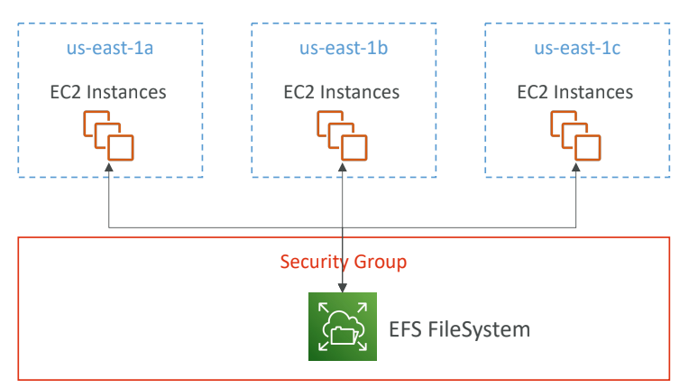

* This is the third type of storage that you can attach to an EC2 instance
* It is a managed NFS (network file system) that **can be mounted on 100s of EC2 at a time**. That makes it a shared network file system
* EFS only works with **Linux** EC2 instances in **multi-AZ**. So it is possible for an instance in one AZ to be attaching the same EFS Volume as the volume in another AZ
* Highly available, scalable, expensive (3x gp2), pay per use, no capacity planning (if you store 20 GBs of data onto your EFS drive then you are only going to pay for these 20 GBs)
* **Use cases:** content management, web serving, data sharing, Wordpress
* Uses NFSv4.1 protocol
* Uses security group to control access to EFS
* Encryption at rest using KMS
* POSIX file system (~Linux) that has a standard file API
* File system scales automatically, pay-per-use, no capacity planning!

### EFS – Performance & Storage Classes

* **EFS Scale**
	* 1000s of concurrent NFS clients, 10 GB+ /s throughput
	* Grow to Petabyte-scale network file system, automatically
* **Performance Mode (set at EFS creation time)**
	* **General Purpose (default):** latency-sensitive use cases (web server, CMS, etc…)
	* **Max I/O:** higher latency, throughput, highly parallel (big data, media processing)
* **Throughput Mode**
	* **Bursting:** 1 TB = 50MiB/s + burst of up to 100MiB/s
	* **Provisioned:** set your throughput regardless of storage size, ex: 1 GiB/s for 1 TB storage
	* **Elastic:** automatically scales throughput up or down based on your workloads
		* Up to 3GiB/s for reads and 1 GiB/s for writes
		* Used for unpredictable workloads

### EFS – Storage Classes

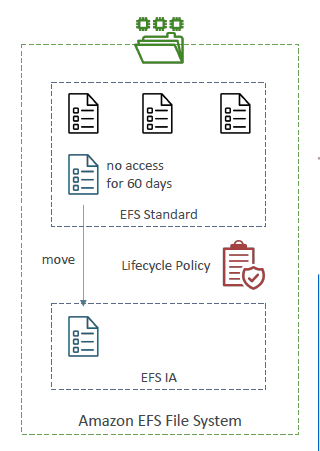

* **Storage Tiers (lifecycle management feature – move file after N days)**
	* **Standard:** for frequently accessed files
	* **Infrequent access (EFS-IA):** cost to retrieve files, lower price to store.
	* **Archive:** rarely accessed data (few times each year), 50% cheaper
	* Implement **lifecycle policies** to move files between storage tiers
* **Availability and durability**
	* **Standard:** Multi-AZ, great for prod
	* **One Zone:** One AZ, great for dev, backup enabled by default, compatible with IA (EFS One Zone-IA)
* Over 90% in cost savings

### EBS vs EFS – Elastic Block Storage

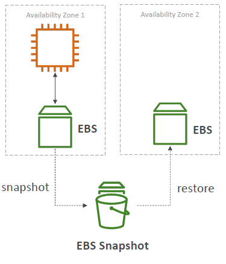

* EBS volumes...
  * one instance (except multi-attach io1/io2)
  * are locked at the Availability Zone (AZ) level
  * gp2: IO increases if the disk size increases
  * gp3 & io1: can increase IO independently
* To migrate an EBS volume across AZ
  * Take a snapshot
  * Restore the snapshot to another AZ
  * EBS backups use IO and you shouldn’t run them while your application is handling a lot of traffic
* Root EBS Volumes of instances get terminated by default if the EC2 instance gets terminated. (you can disable that)

### EBS vs EFS – Elastic File System

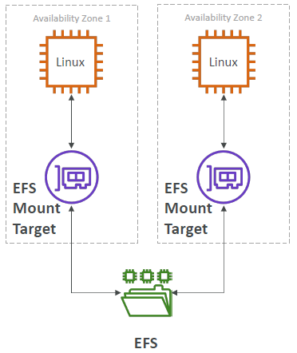

* Mounting 100s of instances across AZ
* EFS share website files (WordPress)
* Only for Linux Instances (POSIX)
* EFS has a higher price point than EBS
* Can leverage Storage Tiers for cost savings
* Remember: EFS vs EBS vs Instance Store