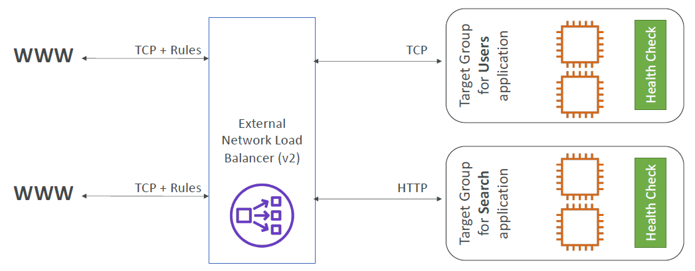
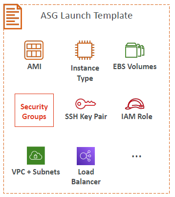
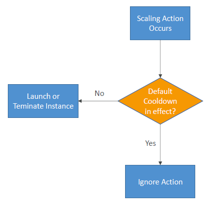

# High Availability & Scalability – ELB & ASG

- [High Availability \& Scalability – ELB \& ASG](#high-availability--scalability--elb--asg)
  - [Scalability \& High Availability](#scalability--high-availability)
  - [Vertical Scalability](#vertical-scalability)
  - [Horizontal Scalability](#horizontal-scalability)
  - [High Availability](#high-availability)
  - [High Availability \& Scalability for EC2](#high-availability--scalability-for-ec2)
  - [Scalability vs Elasticity (vs Agility)](#scalability-vs-elasticity-vs-agility)
  - [What is Load Balancing?](#what-is-load-balancing)
    - [Why Use a Load Balancer?](#why-use-a-load-balancer)
    - [Why Use an Elastic Load Balancer?](#why-use-an-elastic-load-balancer)
  - [Health Checks](#health-checks)
  - [Types of load balancer on AWS](#types-of-load-balancer-on-aws)
  - [Load Balancer Security Groups](#load-balancer-security-groups)
  - [Classic Load Balancers (v1)](#classic-load-balancers-v1)
  - [Application Load Balancer (v2)](#application-load-balancer-v2)
    - [Application Load Balancer (v2)](#application-load-balancer-v2-1)
      - [HTTP Based Traffic](#http-based-traffic)
    - [Application Load Balancer (v2)](#application-load-balancer-v2-2)
      - [Target Groups](#target-groups)
    - [Application Load Balancer (v2)](#application-load-balancer-v2-3)
      - [Query Strings/Parameters Routing](#query-stringsparameters-routing)
    - [Application Load Balancer (v2)](#application-load-balancer-v2-4)
      - [Good to Know](#good-to-know)
    - [Network Load Balancer (v2)](#network-load-balancer-v2)
    - [Network Load Balancer (v2)](#network-load-balancer-v2-1)
      - [TCP (Layer 4) Based Traffic](#tcp-layer-4-based-traffic)
    - [Network Load Balancer – Target Groups](#network-load-balancer--target-groups)
    - [Gateway Load Balancer](#gateway-load-balancer)
    - [Gateway Load Balancer – Target Groups](#gateway-load-balancer--target-groups)
  - [Sticky Sessions (Session Affinity)](#sticky-sessions-session-affinity)
  - [Sticky Sessions – Cookie Names](#sticky-sessions--cookie-names)
  - [Cross-Zone Load Balancing](#cross-zone-load-balancing)
  - [SSL/TLS - Basics](#ssltls---basics)
  - [Load Balancer - SSL Certificates](#load-balancer---ssl-certificates)
  - [SSL – Server Name Indication (SNI)](#ssl--server-name-indication-sni)
  - [Elastic Load Balancers – SSL Certificates](#elastic-load-balancers--ssl-certificates)
  - [Connection Draining](#connection-draining)
  - [What’s an Auto Scaling Group?](#whats-an-auto-scaling-group)
  - [Auto Scaling Group in AWS](#auto-scaling-group-in-aws)
  - [Auto Scaling Group in AWS With Load Balancer](#auto-scaling-group-in-aws-with-load-balancer)
  - [Auto Scaling Group Attributes](#auto-scaling-group-attributes)
  - [Auto Scaling - CloudWatch Alarms \& Scaling](#auto-scaling---cloudwatch-alarms--scaling)
  - [Auto Scaling Groups – Scaling Policies](#auto-scaling-groups--scaling-policies)
  - [Good metrics to scale on](#good-metrics-to-scale-on)
  - [Auto Scaling Groups - Scaling Cooldowns](#auto-scaling-groups---scaling-cooldowns)

## Scalability & High Availability

* **Scalability**: Ability of a system to handle an increase in load by adapting to the demand
* **High Availability**: Ensures a system is operational and accessible for a high percentage of time, often achieved by reducing the impact of failures
* There are **two kinds** of scalability:
  * Vertical Scalability
  * Horizontal Scalability (= elasticity)
* **Scalability is linked but different to High Availability**

## Vertical Scalability

* Vertical Scalability means increasing the size of the instance
* For example, your application runs on a t2.micro
* Scaling that application vertically means running it on a t2.large
* Vertical scalability is very common for non-distributed systems, such as a database
* RDS, ElastiCache are services that can scale vertically.
* There's usually a limit to how much you can vertically scale (hardware limit)

## Horizontal Scalability

* Horizontal Scalability means increasing the number of instances / systems for your application
* Horizontal scaling implies distributed systems
* This is very common for web applications / modern applications
* It's easy to horizontally scale thanks the cloud offerings such as Amazon EC2

## High Availability

* High Availability usually goes hand in hand with Horizontal Scaling
* High Availability means running your application / system in at least 2 Availability Zones (== Availability Zones)
* The goal of High Availability is to survive a data center loss (disaster)
* The high availability can be passive (for RDS Multi AZ for example)
* The high availability can be active (for horizontal scaling)

## High Availability & Scalability for EC2

* **Vertical Scaling:** Increase instance size (= scale up / down)
  * From: t2.nano - 0.5G of RAM, 1 vCPU
  * To: u-12tb1.metal – 12.3 TB of RAM, 448 vCPUs
* **Horizontal Scaling:** Increase number of instances (= scale out / in)
  * Auto Scaling Group
  * Load Balancer
* **High Availability:** Run instances for the same application across multi AZ
  * Auto Scaling Group multi AZ
  * Load Balancer multi AZ

## Scalability vs Elasticity (vs Agility)

| **Term** | **Definition** |
| -------- | -------------- |
| **Scalability** | ability to accommodate a larger load by making the hardware stronger (scale up), or by adding nodes (scale out) |
| **Elasticity**  | once a system is scalable, elasticity means that there will be some “auto-scaling” so that the system can scale based on the load. This is “cloud-friendly”: pay-per-use, match demand, optimize costs |
| **Agility** | (not related to scalability - distractor) new IT resources are only a click away, which means that you reduce the time to make those resources available to your developers from weeks to just minutes. |

## What is Load Balancing?

* Load balancers are servers that forward internet traffic to multiple servers (EC2 Instances) downstream

### Why Use a Load Balancer?

* Spread load across multiple downstream instances
* Expose a single point of access (DNS) to your application
* Seamlessly handle failures of downstream instances
* Do regular health checks to your instances
* Provide SSL termination (HTTPS) for your websites
* High availability across zones

### Why Use an Elastic Load Balancer?

* An ELB (Elastic Load Balancer) is a **managed load balancer**
  * AWS guarantees that it will be working
  * AWS takes care of upgrades, maintenance, high availability
  * AWS provides only a few configuration knobs
* It costs less to setup your own load balancer but it will be a lot more effort on your end (maintenance, integrations)
* 4 kinds of load balancers offered by AWS:
  * Application Load Balancer (HTTP / HTTPS only) – Layer 7
  * Network Load Balancer (ultra-high performance, allows for TCP) – Layer 4
  * Gateway Load Balancer – Layer 3
  * Classic Load Balancer (retired in 2023) – Layer 4 & 7

## Health Checks

* Health Checks are crucial for Load Balancers
* They enable the load balancer to know if instances it forwards traffic to are available to reply to requests
* The health check is done on a port and a route (/health is common)
* If the response is not 200 (OK), then the instance is unhealthy

## Types of load balancer on AWS

* AWS has **4 kinds of managed Load Balancers**
* **Classic Load Balancer** (v1 - old generation) – 2009 – CLB
  * HTTP, HTTPS, TCP, SSL (secure TCP)
* **Application Load Balancer** (v2 - new generation) – 2016 – ALB
  * HTTP, HTTPS, WebSocket
* **Network Load Balancer** (v2 - new generation) – 2017 – NLB
  * TCP, TLS (secure TCP), UDP
* **Gateway Load Balancer** – 2020 – GWLB
  * Operates at layer 3 (Network layer) – IP Protocol
* Overall, it is recommended to use the newer generation load balancers as they provide more features
* Some load balancers can be setup as **internal** (private) or **external** (public) ELBs

## Load Balancer Security Groups

## Classic Load Balancers (v1)

* Supports TCP (Layer 4), HTTP & HTTPS (Layer 7)
* Health checks are TCP or HTTP based
* Fixed hostname XXX.region.elb.amazonaws.com

## Application Load Balancer (v2)

* Application load balancers is Layer 7 (HTTP)
* Load balancing to multiple HTTP applications across machines (target groups)
* Load balancing to multiple applications on the same machine (ex: containers)
* Support for HTTP/2 and WebSocket
* Support redirects (from HTTP to HTTPS for example)
* Routing tables to different target groups:
* Routing based on path in URL (example.com/**users** & example.com/**posts**)
* Routing based on hostname in URL (**one.example.com** & **other.example.com**)
* Routing based on Query String, Headers (example.com/users?**id=123&order=false**)
* ALB are a great fit for micro services & container-based application (example: Docker & Amazon ECS)
* Has a port mapping feature to redirect to a dynamic port in ECS
* In comparison, we’d need multiple Classic Load Balancer per application

### Application Load Balancer (v2)
#### HTTP Based Traffic

### Application Load Balancer (v2)
#### Target Groups

* EC2 instances (can be managed by an Auto Scaling Group) – HTTP
* ECS tasks (managed by ECS itself) – HTTP
* Lambda functions – HTTP request is translated into a JSON event
* IP Addresses – must be private IPs
* ALB can route to multiple target groups
* Health checks are at the target group level

### Application Load Balancer (v2)
#### Query Strings/Parameters Routing

### Application Load Balancer (v2)
#### Good to Know

* Fixed hostname (XXX.region.elb.amazonaws.com)
* The application servers don’t see the IP of the client directly
* The true IP of the client is inserted in the header **X-Forwarded-For**
* We can also get Port (X-Forwarded-Port) and proto (X-Forwarded-Proto)

### Network Load Balancer (v2)

• Network load balancers (Layer 4) allow to:
  • **Forward TCP & UDP traffic to your instances**
  • Handle millions of request per seconds
  • Ultra-low latency
• **NLB has one static IP per AZ, and supports assigning Elastic IP** (helpful for whitelisting specific IP)
• NLB are used for extreme performance, TCP or UDP traffic
• Not included in the AWS free tier

### Network Load Balancer (v2)
#### TCP (Layer 4) Based Traffic

### Network Load Balancer – Target Groups

* **EC2 instances**
* **IP Addresses** – must be private IPs
* **Application Load Balancer**
* Health Checks support the **TCP, HTTP and HTTPS Protocols**

### Gateway Load Balancer

* Deploy, scale, and manage a fleet of 3rd party network virtual appliances in AWS
* Example: Firewalls, Intrusion Detection and Prevention Systems, Deep Packet Inspection Systems, payload manipulation, …
* Operates at Layer 3 (Network Layer) – IP Packets
* Combines the following functions:
  * **Transparent Network Gateway** – single entry/exit for all traffic
  * **Load Balancer** – distributes traffic to your virtual appliances
* Uses the **GENEVE** protocol on port **6081**

### Gateway Load Balancer – Target Groups

* EC2 instances
* IP Addresses – must be private IPs

## Sticky Sessions (Session Affinity)

* It is possible to implement stickiness so that the same client is always redirected to the same instance behind a load balancer
* This works for **Classic Load Balancer, Application Load Balancer, and Network Load Balancer**
* For both CLB & ALB, the “cookie” used for stickiness has an expiration date you control
* Use case: make sure the user doesn’t lose his session data
* Enabling stickiness may bring imbalance to the load over the backend EC2 instances

## Sticky Sessions – Cookie Names

* **Application-based Cookies**
  * **Custom cookie**
    * Generated by the target
    * Can include any custom attributes required by the application
    * Cookie name must be specified individually for each target group
    * Don’t use **AWSALB, AWSALBAPP, or AWSALBTG** (reserved for use by the ELB)
  * **Application cookie**
    * Generated by the load balancer
    * Cookie name is AWSALBAPP
* **Duration-based Cookies**
  * Cookie generated by the load balancer
  * Cookie name is **AWSALB** for ALB, **AWSELB** for CLB

## Cross-Zone Load Balancing

* **Application Load Balancer**
  * Enabled by default (can be disabled at the Target Group level)
  * No charges for inter AZ data
* **Network Load Balancer & Gateway Load Balancer**
  * Disabled by default
  * You pay charges ($) for inter AZ data if enabled
* **Classic Load Balancer**
  * Disabled by default
  * No charges for inter AZ data if enabled

## SSL/TLS - Basics

* An SSL Certificate allows traffic between your clients and your load balancer to be encrypted in transit (in-flight encryption)
* **SSL** refers to Secure Sockets Layer, used to encrypt connections
* **TLS** refers to Transport Layer Security, which is a newer version
* Nowadays, **TLS certificates are mainly used**, but people still refer as SSL
* Public SSL certificates are issued by Certificate Authorities (CA)
* Comodo, Symantec, GoDaddy, GlobalSign, Digicert, Letsencrypt, etc...
* SSL certificates have an expiration date (you set) and must be renewed

## Load Balancer - SSL Certificates

* The load balancer uses an X.509 certificate (SSL/TLS server certificate)
* You can manage certificates using ACM (AWS Certificate Manager)
* You can create upload your own certificates alternatively
* HTTPS listener:
  * You must specify a default certificate
  * You can add an optional list of certs to support multiple domains
  * **Clients can use SNI (Server Name Indication) to specify the hostname they reach**
  * Ability to specify a security policy to support older versions of SSL / TLS (legacy clients)

## SSL – Server Name Indication (SNI)

* SNI solves the problem of loading **multiple SSL certificates onto one web server** (to serve multiple websites)
* It’s a “newer” protocol, and requires the client to indicate the hostname of the target server in the initial SSL handshake
* The server will then find the correct certificate, or return the default one

**Note:**
* Only works for ALB & NLB (newer generation), CloudFront
* Does not work for CLB (older gen)

## Elastic Load Balancers – SSL Certificates

* **Classic Load Balancer (v1)**
  * Support only one SSL certificate
  * Must use multiple CLB for multiple hostname with multiple SSL certificates
* **Application Load Balancer (v2)**
  * Supports multiple listeners with multiple SSL certificates
  * Uses Server Name Indication (SNI) to make it work
* **Network Load Balancer (v2)**
  * Supports multiple listeners with multiple SSL certificates
  * Uses Server Name Indication (SNI) to make it work

## Connection Draining

* **Feature naming**
  * Connection Draining – for CLB
  * Deregistration Delay – for ALB & NLB
* Time to complete “in-flight requests” while the instance is de-registering or unhealthy
* Stops sending new requests to the EC2 instance which is de-registering
* Between 1 to 3600 seconds (default: 30 seconds)
* Can be disabled (set value to 0)
* Set to a low value if your requests are short

## What’s an Auto Scaling Group?

* In real-life, the load on your websites and application can change
* In the cloud, you can create and get rid of servers very quickly
* The goal of an Auto Scaling Group (ASG) is to:
  * Scale out (add EC2 instances) to match an increased load
  * Scale in (remove EC2 instances) to match a decreased load
  * Ensure we have a minimum and a maximum number of EC2 instances running
  * Automatically register new instances to a load balancer
  * Re-create an EC2 instance in case a previous one is terminated (ex: if unhealthy)
* ASG are free (you only pay for the underlying EC2 instances)

## Auto Scaling Group in AWS

## Auto Scaling Group in AWS With Load Balancer

## Auto Scaling Group Attributes

* A Launch Template (older “Launch Configurations” are deprecated)
  * AMI + Instance Type
  * EC2 User Data
  * EBS Volumes
  * Security Groups
  * SSH Key Pair
  * IAM Roles for your EC2 Instances
  * Network + Subnets Information
  * Load Balancer Information
* Min Size / Max Size / Initial Capacity
* Scaling Policies

## Auto Scaling - CloudWatch Alarms & Scaling

* It is possible to scale an ASG based on CloudWatch alarms
* An alarm monitors a metric (such as **Average CPU**, or a **custom metric**)
* **Metrics such as Average CPU are computed for the overall ASG instances**
* Based on the alarm:
  * We can create scale-out policies (increase the number of instances)
  * We can create scale-in policies (decrease the number of instances)

## Auto Scaling Groups – Scaling Policies

* **Dynamic Scaling**
  * **Target Tracking Scaling**
    * Simple to set-up
    * Example: I want the average ASG CPU to stay at around 40%
  * **Simple / Step Scaling**
    * When a CloudWatch alarm is triggered (example CPU > 70%), then add 2 units
    * When a CloudWatch alarm is triggered (example CPU < 30%), then remove 1
* **Scheduled Scaling**
  * Anticipate a scaling based on known usage patterns
  * Example: increase the min capacity to 10 at 5 pm on Fridays

* **Predictive scaling:** continuously forecast load and schedule scaling ahead

## Good metrics to scale on

* **CPUUtilization:** Average CPU utilization across your instances
* **RequestCountPerTarget:** to make sure the number of requests per EC2 instances is stable
* **Average Network In / Out** (if you’re application is network bound)
* **Any custom metric** (that you push using CloudWatch)

## Auto Scaling Groups - Scaling Cooldowns

* After a scaling activity happens, you are in the **cooldown period (default 300 seconds)**
* During the cooldown period, the ASG will not launch or terminate additional instances (to allow for metrics to stabilize)
* Advice: Use a ready-to-use AMI to reduce configuration time in order to be serving request fasters and reduce the cooldown period