# RDS, Aurora and ElasticCache

- [RDS, Aurora and ElasticCache](#rds-aurora-and-elasticcache)
	- [Amazon RDS Overview](#amazon-rds-overview)
	- [Advantage over using RDS versus deploying](#advantage-over-using-rds-versus-deploying)
		- [DB on EC2](#db-on-ec2)
	- [RDS – Storage Auto Scaling](#rds--storage-auto-scaling)
	- [RDS Read Replicas for read scalability](#rds-read-replicas-for-read-scalability)
	- [RDS Read Replicas – Use Cases](#rds-read-replicas--use-cases)
	- [RDS Read Replicas – Network Cost](#rds-read-replicas--network-cost)
	- [RDS Multi AZ (Disaster Recovery)](#rds-multi-az-disaster-recovery)
	- [RDS – From Single-AZ to Multi-AZ](#rds--from-single-az-to-multi-az)
	- [RDS Custom](#rds-custom)
	- [Amazon Aurora](#amazon-aurora)
	- [Aurora High Availability and Read Scaling](#aurora-high-availability-and-read-scaling)
	- [Aurora DB Cluster](#aurora-db-cluster)
	- [Features of Aurora](#features-of-aurora)
	- [Aurora Replicas - Auto Scaling](#aurora-replicas---auto-scaling)
	- [Aurora – Custom Endpoints](#aurora--custom-endpoints)
	- [Aurora Serverless](#aurora-serverless)
	- [Global Aurora](#global-aurora)
	- [Aurora Machine Learning](#aurora-machine-learning)
	- [Babelfish for Aurora PostgreSQL](#babelfish-for-aurora-postgresql)
	- [RDS Backups](#rds-backups)
	- [Aurora Backups](#aurora-backups)
	- [RDS \& Aurora Restore options](#rds--aurora-restore-options)
	- [Aurora Database Cloning](#aurora-database-cloning)
	- [RDS \& Aurora Security](#rds--aurora-security)
	- [Amazon RDS Proxy](#amazon-rds-proxy)
	- [Amazon ElastiCache Overview](#amazon-elasticache-overview)
	- [ElastiCache](#elasticache)
		- [Solution Architecture - DB Cache](#solution-architecture---db-cache)
	- [ElastiCache](#elasticache-1)
		- [Solution Architecture – User Session Store](#solution-architecture--user-session-store)
	- [ElastiCache – Redis vs Memcached](#elasticache--redis-vs-memcached)
		- [REDIS](#redis)
		- [MEMCACHED](#memcached)
	- [ElastiCache – Cache Security](#elasticache--cache-security)
	- [Patterns for ElastiCache](#patterns-for-elasticache)
	- [ElastiCache – Redis Use Case](#elasticache--redis-use-case)

## Amazon RDS Overview

* RDS stands for Relational Database Service
* It’s a managed DB service for DB use SQL as a query language.
* It allows you to create databases in the cloud that are managed by AWS
	* Postgres
	* MySQL
	* MariaDB
	* Oracle
	* Microsoft SQL Server
	* IBM DB2
	* Aurora (AWS Proprietary database)

## Advantage over using RDS versus deploying
### DB on EC2

* RDS is a managed service:
  * Automated provisioning, OS patching
  * Continuous backups and restore to specific timestamp (Point in Time Restore)!
  * Monitoring dashboards
  * Read replicas for improved read performance
  * Multi AZ setup for DR (Disaster Recovery)
  * Maintenance windows for upgrades
  * Scaling capability (vertical and horizontal)
  * Storage backed by EBS
* BUT you can’t SSH into your instances

## RDS – Storage Auto Scaling

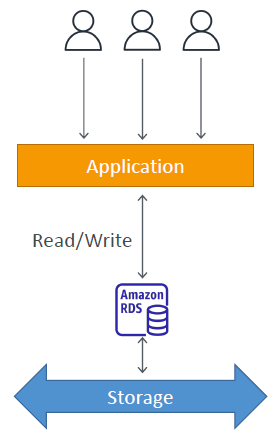

* Helps you increase storage on your RDS DB instance dynamically
* When RDS detects you are running out of free database storage, it scales automatically
* Avoid manually scaling your database storage
* You have to set **Maximum Storage Threshold** (maximum limit for DB storage)
* Automatically modify storage if:
	* Free storage is less than 10% of allocated storage
	* Low-storage lasts at least 5 minutes
	* 6 hours have passed since last modification
* Useful for applications with **unpredictable workloads**
* Supports all RDS database engines

## RDS Read Replicas for read scalability

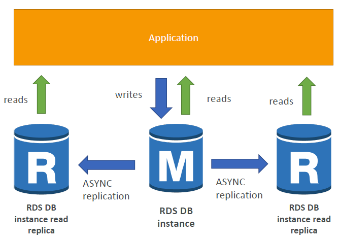

* Up to 15 Read Replicas
* Within AZ, Cross AZ or Cross Region
* Replication is ASYNC, so reads are eventually consistent
* Replicas can be promoted to their own DB
* Applications must update the connection string to leverage read replicas

## RDS Read Replicas – Use Cases

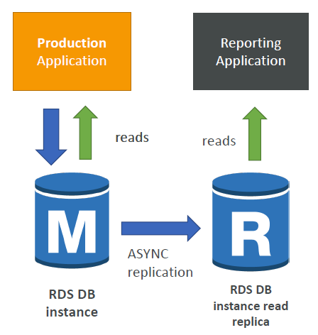

* You have a production database that is taking on normal load
* You want to run a reporting application to run some analytics
* You create a Read Replica to run the new workload there
* The production application is unaffected
* Read replicas are used for SELECT (=read) only kind of statements (not INSERT, UPDATE, DELETE)

## RDS Read Replicas – Network Cost

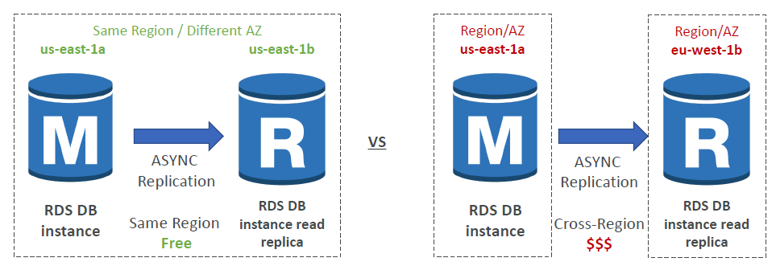

* In AWS there is a network cost when data goes from one AZ to another
* For RDS Read Replicas within the same region, you don’t pay that fee

## RDS Multi AZ (Disaster Recovery)

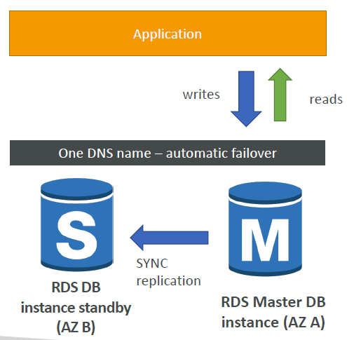

* SYNC replication
* One DNS name – automatic app failover to standby
* Increase availability
* Failover in case of loss of AZ, loss of network, instance or storage failure
* No manual intervention in apps
* Not used for scaling
* Note: The Read Replicas be setup as Multi AZ for Disaster Recovery (DR)

## RDS – From Single-AZ to Multi-AZ

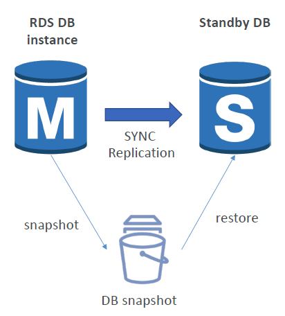

* Zero downtime operation (no need to stop the DB)
* Just click on “modify” for the database
* The following happens internally:
* A snapshot is taken
* A new DB is restored from the snapshot in a new AZ
* Synchronization is established between the two databases

## RDS Custom

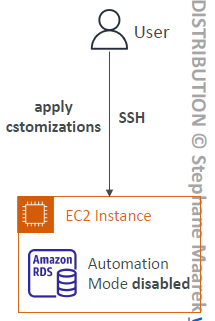

* **Managed Oracle and Microsoft SQL Server Database with OS and database customization**
* RDS: Automates setup, operation, and scaling of database in AWS
* Custom: access to the underlying database and OS so you can
* Configure settings
* Install patches
* Enable native features
* Access the underlying EC2 Instance using **SSH** or **SSM Session Manager**
* **De-activate Automation Mode** to perform your customization, better to take a DB snapshot before
* RDS vs. RDS Custom
* RDS: entire database and the OS to be managed by AWS
* RDS Custom: full admin access to the underlying OS and the database

## Amazon Aurora

* Aurora is a proprietary technology from AWS (not open sourced)
* Postgres and MySQL are both supported as Aurora DB (that means your drivers will work as if Aurora was a Postgres or MySQL database)
* Aurora is “AWS cloud optimized” and claims 5x performance improvement over MySQL on RDS, over 3x the performance of Postgres on RDS
* Aurora storage automatically grows in increments of 10GB, up to 128 TB.
* Aurora can have up to 15 replicas and the replication process is faster than MySQL (sub 10 ms replica lag)
* Failover in Aurora is instantaneous. It’s HA (High Availability) native.
* Aurora costs more than RDS (20% more) – but is more efficient

## Aurora High Availability and Read Scaling

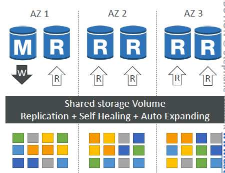

* 6 copies of your data across 3 AZ:
* 4 copies out of 6 needed for writes
* 3 copies out of 6 need for reads
* Self healing with peer-to-peer replication
* Storage is striped across 100s of volumes
* One Aurora Instance takes writes (master)
* Automated failover for master in less than 30 seconds
* Master + up to 15 Aurora Read Replicas serve reads
* Support for Cross Region Replication

## Aurora DB Cluster

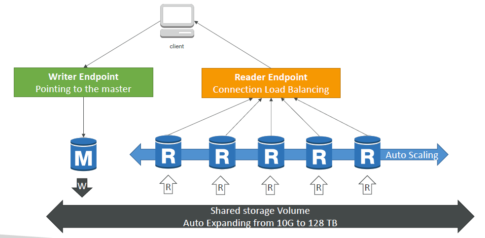

## Features of Aurora

* Automatic fail-over
* Backup and Recovery
* Isolation and security
* Industry compliance
* Push-button scaling
* Automated Patching with Zero Downtime
* Advanced Monitoring
* Routine Maintenance
* Backtrack: restore data at any point of time without using backups

## Aurora Replicas - Auto Scaling

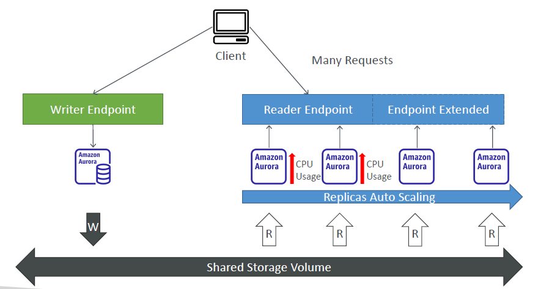

## Aurora – Custom Endpoints

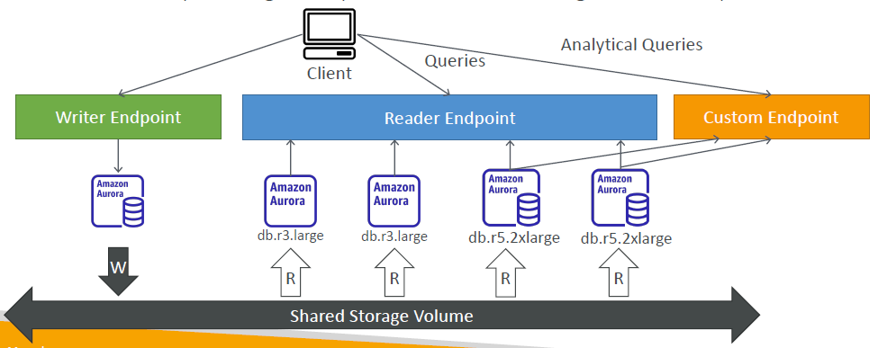

* Define a subset of Aurora Instances as a Custom Endpoint
* Example: Run analytical queries on specific replicas
* The Reader Endpoint is generally not used after defining Custom Endpoints

## Aurora Serverless

* Automated database instantiation and autoscaling based on actual usage
* Good for infrequent, intermittent or unpredictable workloads
* No capacity planning needed
* Pay per second, can be more cost-effective

## Global Aurora

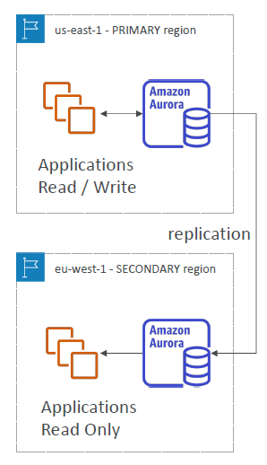

* **Aurora Cross Region Read Replicas:**
  * Useful for disaster recovery
  * Simple to put in place
* **Aurora Global Database (recommended):**
  * 1 Primary Region (read / write)
  * Up to 5 secondary (read-only) regions, replication lag is less than 1 second
  * Up to 16 Read Replicas per secondary region
  * Helps for decreasing latency
  * Promoting another region (for disaster recovery) has an RTO of < 1 minute
  * **Typical cross-region replication takes less than 1 second**

## Aurora Machine Learning

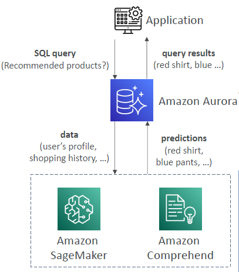

* Enables you to add ML-based predictions to your applications via SQL
* Simple, optimized, and secure integration between Aurora and AWS ML services
* Supported services
* Amazon SageMaker (use with any ML model)
* Amazon Comprehend (for sentiment analysis)
* You don’t need to have ML experience
* Use cases: fraud detection, ads targeting, sentiment analysis, product recommendations

## Babelfish for Aurora PostgreSQL

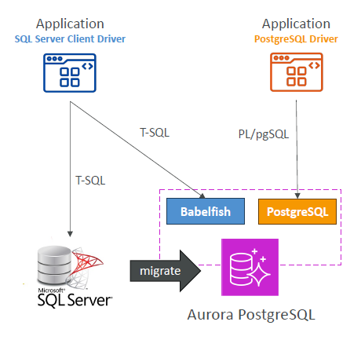

* Allows Aurora PostgreSQL to understand commands targeted for MS SQL Server (e.g., T-SQL)
* Therefore Microsoft SQL Server based applications can work on Aurora PostgreSQL
* Requires no to little code changes (using the same MS SQL Server client driver)
* The same applications can be used after a migration of your database (using AWS SCT and DMS)

## RDS Backups

* **Automated backups:**
  * Daily full backup of the database (during the backup window)
  * Transaction logs are backed-up by RDS every 5 minutes
  * => ability to restore to any point in time (from oldest backup to 5 minutes ago)
  * 1 to 35 days of retention, set 0 to disable automated backups
* **Manual DB Snapshots**
  * Manually triggered by the user
  * Retention of backup for as long as you want
* **Trick:** in a stopped RDS database, you will still pay for storage. If you plan on stopping it for a long time, you should snapshot & restore instead

## Aurora Backups

* **Automated backups**
  * 1 to 35 days (cannot be disabled)
  * point-in-time recovery in that timeframe
* **Manual DB Snapshots**
  * Manually triggered by the user
  * Retention of backup for as long as you want

## RDS & Aurora Restore options

* **Restoring a RDS / Aurora backup or a snapshot creates a new database**
* **Restoring MySQL RDS database from S3**
	* Create a backup of your on-premises database
	* Store it on Amazon S3 (object storage)
	* Restore the backup file onto a new RDS instance running MySQL
* **Restoring MySQL Aurora cluster from S3**
	* Create a backup of your on-premises database using Percona XtraBackup
	* Store the backup file on Amazon S3
	* Restore the backup file onto a new Aurora cluster running MySQL

## Aurora Database Cloning

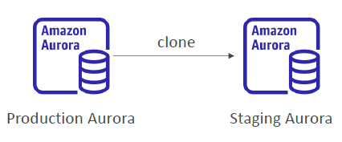

* Create a new Aurora DB Cluster from an existing one
* Faster than snapshot & restore
* Uses ***copy-on-write*** protocol
  * Initially, the new DB cluster uses the same data volume as the original DB cluster (fast and efficient – no copying is needed)
  * When updates are made to the new DB cluster data, then additional storage is allocated and data is copied to be separated
* Very fast & cost-effective
* **Useful to create a “staging” database from a “production” database without impacting the production database**

## RDS & Aurora Security

* **At-rest encryption:**
	* Database master & replicas encryption using AWS KMS – must be defined as launch time
	* If the master is not encrypted, the read replicas cannot be encrypted
	* To encrypt an un-encrypted database, go through a DB snapshot & restore as encrypted
* **In-flight encryption:** TLS-ready by default, use the AWS TLS root certificates client-side
* **IAM Authentication:** IAM roles to connect to your database (instead of username/pw)
* **Security Groups:** Control Network access to your RDS / Aurora DB
* **No SSH available** except on RDS Custom
* **Audit Logs can be enabled** and sent to CloudWatch Logs for longer retention

## Amazon RDS Proxy

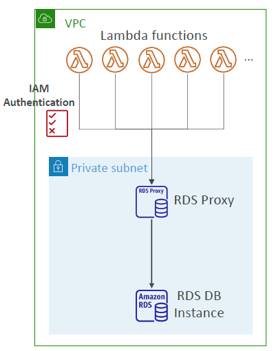

* Fully managed database proxy for RDS
* Allows apps to pool and share DB connections established with the database
* **Improving database efficiency by reducing the stress on database resources (e.g., CPU, RAM) and minimize open connections (and timeouts)**
* Serverless, autoscaling, highly available (multi-AZ)
* **Reduced RDS & Aurora failover time by up 66%**
* Supports RDS (MySQL, PostgreSQL, MariaDB, MS SQL Server) and Aurora (MySQL, PostgreSQL)
* No code changes required for most apps
* **Enforce IAM Authentication for DB, and securely store credentials in AWS Secrets Manager**
* **RDS Proxy is never publicly accessible (must be accessed from VPC)**

## Amazon ElastiCache Overview

* The same way RDS is to get managed Relational Databases...
* ElastiCache is to get managed Redis or Memcached
* Caches are in-memory databases with really high performance, low latency
* Helps reduce load off of databases for read intensive workloads
* Helps make your application stateless
* AWS takes care of OS maintenance / patching, optimizations, setup, configuration, monitoring, failure recovery and backups
* **Using ElastiCache involves heavy application code changes**

## ElastiCache
### Solution Architecture - DB Cache

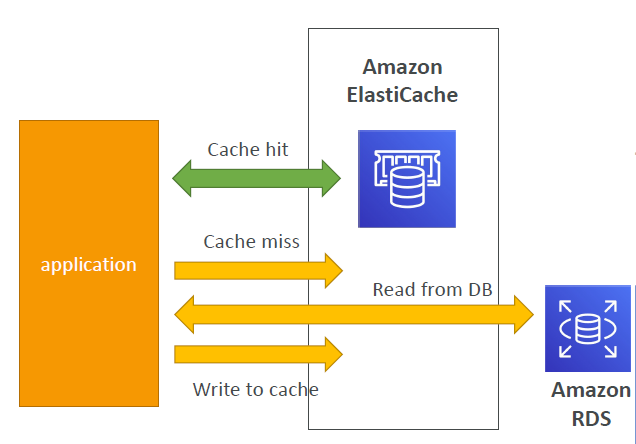

* Applications queries ElastiCache, if not available, get from RDS and store in ElastiCache.
* Helps relieve load in RDS
* Cache must have an invalidation strategy to make sure only the most current data is used in there.

## ElastiCache
### Solution Architecture – User Session Store

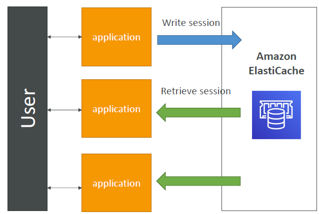

* User logs into any of the application
* The application writes the session data into ElastiCache
* The user hits another instance of our application
* The instance retrieves the data and the user is already logged in

## ElastiCache – Redis vs Memcached

### REDIS

* **Multi AZ** with Auto-Failover
* **Read Replicas** to scale reads and have **high availability**
* Data Durability using AOF persistence
* **Backup and restore features**
* Supports Sets and Sorted Sets

### MEMCACHED

* Multi-node for partitioning of data (sharding)
* **No high availability (replication)**
* **Non persistent**
* **Backup and restore (Serverless)**
* Multi-threaded architecture

## ElastiCache – Cache Security

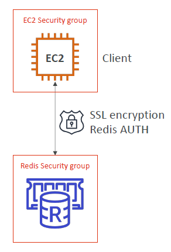

* ElastiCache supports **IAM Authentication for Redis**
* IAM policies on ElastiCache are only used for AWS API-level security
* **Redis AUTH**
  * You can set a “password/token” when you create a Redis cluster
  * This is an extra level of security for your cache (on top of security groups)
  * Support SSL in flight encryption
* **Memcached**
  * Supports SASL-based authentication (advanced)

## Patterns for ElastiCache

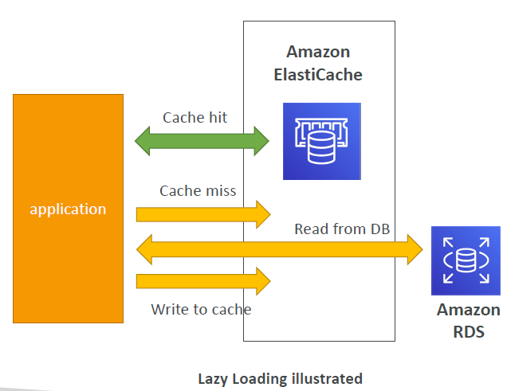

* **Lazy Loading:** all the read data is cached, data can become stale in cache
* **Write Through:** Adds or update data in the cache when written to a DB (no stale data)
* **Session Store:** store temporary session data in a cache (using TTL features)
* **Quote:** There are only two hard things in Computer Science: cache invalidation and naming things

## ElastiCache – Redis Use Case

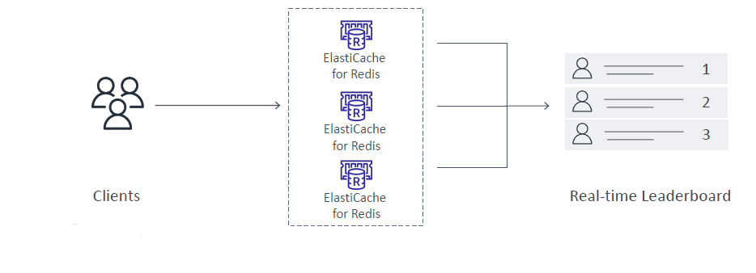

* Gaming Leaderboards are computationally complex
* **Redis Sorted sets** guarantee both uniqueness and element ordering
* Each time a new element added, it’s ranked in real time, then added in correct order