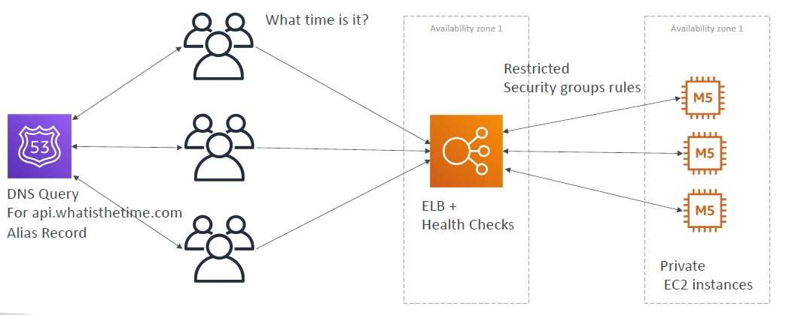

# Classic Solutions Architecture

- [Classic Solutions Architecture](#classic-solutions-architecture)
	- [Section Introduction](#section-introduction)
	- [Stateless Web App: WhatIsTheTime.com](#stateless-web-app-whatisthetimecom)
	- [Stateless web app: What time is it?](#stateless-web-app-what-time-is-it)
		- [Starting simple](#starting-simple)
	- [Stateless web app: What time is it?](#stateless-web-app-what-time-is-it-1)
		- [Scaling vertically](#scaling-vertically)
	- [Stateless web app: What time is it?](#stateless-web-app-what-time-is-it-2)
		- [Scaling horizontally](#scaling-horizontally)
	- [Stateless web app: What time is it?](#stateless-web-app-what-time-is-it-3)
		- [Scaling horizontally, adding and removing instances](#scaling-horizontally-adding-and-removing-instances)
	- [Stateless web app: What time is it?](#stateless-web-app-what-time-is-it-4)
		- [Scaling horizontally, with a load balancer](#scaling-horizontally-with-a-load-balancer)
	- [Stateless web app: What time is it?](#stateless-web-app-what-time-is-it-5)
		- [Scaling horizontally, with an auto-scaling group](#scaling-horizontally-with-an-auto-scaling-group)
	- [Stateless web app: What time is it?](#stateless-web-app-what-time-is-it-6)
		- [Making our app multi-AZ](#making-our-app-multi-az)
	- [Minimum 2 AZ =\> Let’s reserve capacity](#minimum-2-az--lets-reserve-capacity)
	- [In this lecture we’ve discussed…](#in-this-lecture-weve-discussed)
	- [Stateful Web App: MyClothes.com](#stateful-web-app-myclothescom)
	- [Stateful Web App: MyClothes.com](#stateful-web-app-myclothescom-1)
	- [Stateful Web App: MyClothes.com](#stateful-web-app-myclothescom-2)
		- [Introduce Stickiness (Session Affinity)](#introduce-stickiness-session-affinity)
	- [Stateful Web App: MyClothes.com](#stateful-web-app-myclothescom-3)
		- [Introduce User Cookies](#introduce-user-cookies)
	- [Stateful Web App: MyClothes.com](#stateful-web-app-myclothescom-4)
		- [Introduce Server Session](#introduce-server-session)
	- [Stateful Web App: MyClothes.com](#stateful-web-app-myclothescom-5)
		- [Storing User Data in a database](#storing-user-data-in-a-database)
	- [Stateful Web App: MyClothes.com](#stateful-web-app-myclothescom-6)
		- [Scaling Reads](#scaling-reads)
	- [Stateful Web App: MyClothes.com](#stateful-web-app-myclothescom-7)
		- [Scaling Reads (Alternative) – Lazy Loading](#scaling-reads-alternative--lazy-loading)
	- [Stateful Web App: MyClothes.com](#stateful-web-app-myclothescom-8)
		- [Multi AZ – Survive disasters](#multi-az--survive-disasters)
	- [Stateful Web App: MyClothes.com](#stateful-web-app-myclothescom-9)
		- [Security Groups](#security-groups)
	- [In this lecture we’ve discussed…](#in-this-lecture-weve-discussed-1)
		- [3-tier architectures for web applications](#3-tier-architectures-for-web-applications)
	- [Stateful Web App: MyWordPress.com](#stateful-web-app-mywordpresscom)
	- [Stateful Web App: MyWordPress.com](#stateful-web-app-mywordpresscom-1)
		- [RDS layer](#rds-layer)
	- [Stateful Web App: MyWordPress.com](#stateful-web-app-mywordpresscom-2)
		- [Scaling with Aurora: Multi AZ \& Read Replicas](#scaling-with-aurora-multi-az--read-replicas)
	- [Stateful Web App: MyWordPress.com](#stateful-web-app-mywordpresscom-3)
		- [Storing images with EBS](#storing-images-with-ebs)
	- [Stateful Web App: MyWordPress.com](#stateful-web-app-mywordpresscom-4)
		- [Storing images with EFS](#storing-images-with-efs)
	- [In this lecture we’ve discussed…](#in-this-lecture-weve-discussed-2)
	- [Instantiating Applications quickly](#instantiating-applications-quickly)
	- [Instantiating Applications quickly](#instantiating-applications-quickly-1)
	- [Typical architecture: Web App 3-tier](#typical-architecture-web-app-3-tier)
	- [Developer problems on AWS](#developer-problems-on-aws)
	- [Elastic Beanstalk – Overview](#elastic-beanstalk--overview)
	- [Elastic Beanstalk – Components](#elastic-beanstalk--components)
	- [Elastic Beanstalk – Supported Platforms](#elastic-beanstalk--supported-platforms)
	- [Web Server Tier vs. Worker Tier](#web-server-tier-vs-worker-tier)
	- [Elastic Beanstalk Deployment Modes](#elastic-beanstalk-deployment-modes)

## Section Introduction

* These solutions architectures are the best part of this course
* Let’s understand how all the technologies we’ve seen work together
* This is a section you need to be 100% comfortable with
* We’ll see the progression of a Solution’s architect mindset through many sample case studies:
  * WhatIsTheTime.Com
  * MyClothes.Com
  * MyWordPress.Com
  * Instantiating applications quickly
  * Beanstalk

## Stateless Web App: WhatIsTheTime.com

* WhatIsTheTime.com allows people to know what time it is
* We don’t need a database
* We want to start small and can accept downtime
* We want to fully scale vertically and horizontally, no downtime
* Let’s go through the Solutions Architect journey for this app
* Let’s see how we can proceed!

## Stateless web app: What time is it?
### Starting simple

## Stateless web app: What time is it?
### Scaling vertically

## Stateless web app: What time is it?
### Scaling horizontally

## Stateless web app: What time is it?
### Scaling horizontally, adding and removing instances

## Stateless web app: What time is it?
### Scaling horizontally, with a load balancer

## Stateless web app: What time is it?
### Scaling horizontally, with an auto-scaling group

## Stateless web app: What time is it?
### Making our app multi-AZ

## Minimum 2 AZ => Let’s reserve capacity

## In this lecture we’ve discussed…

* Public vs Private IP and EC2 instances
* Elastic IP vs Route 53 vs Load Balancers
* Route 53 TTL, A records and Alias Records
* Maintaining EC2 instances manually vs Auto Scaling Groups
* Multi AZ to survive disasters
* ELB Health Checks
* Security Group Rules
* Reservation of capacity for costing savings when possible

## Stateful Web App: MyClothes.com

* MyClothes.com allows people to buy clothes online.
* There’s a shopping cart
* Our website is having hundreds of users at the same time
* We need to scale, maintain horizontal scalability and keep our web application as stateless as possible
* Users should not lose their shopping cart
* Users should have their details (address, etc) in a database
* Let’s see how we can proceed!

## Stateful Web App: MyClothes.com

## Stateful Web App: MyClothes.com
### Introduce Stickiness (Session Affinity)

## Stateful Web App: MyClothes.com
### Introduce User Cookies

## Stateful Web App: MyClothes.com
### Introduce Server Session

## Stateful Web App: MyClothes.com
### Storing User Data in a database

## Stateful Web App: MyClothes.com
### Scaling Reads

## Stateful Web App: MyClothes.com
### Scaling Reads (Alternative) – Lazy Loading

## Stateful Web App: MyClothes.com
### Multi AZ – Survive disasters

## Stateful Web App: MyClothes.com
### Security Groups

## In this lecture we’ve discussed…
### 3-tier architectures for web applications

* ELB sticky sessions
* Web clients for storing cookies and making our web app stateless
* ElastiCache
	* For storing sessions (alternative: DynamoDB)
	* For caching data from RDS
	* Multi AZ
* RDS
	* For storing user data
	* Read replicas for scaling reads
	* Multi AZ for disaster recovery
* Tight Security with security groups referencing each other

## Stateful Web App: MyWordPress.com

* We are trying to create a fully scalable WordPress website
* We want that website to access and correctly display picture uploads
* Our user data, and the blog content should be stored in a MySQL database.
* Let’s see how we can achieve this!

## Stateful Web App: MyWordPress.com
### RDS layer

## Stateful Web App: MyWordPress.com
### Scaling with Aurora: Multi AZ & Read Replicas

## Stateful Web App: MyWordPress.com
### Storing images with EBS

## Stateful Web App: MyWordPress.com
### Storing images with EFS

## In this lecture we’ve discussed…

* Aurora Database to have easy Multi-AZ and Read-Replicas
* Storing data in EBS (single instance application)
* Vs Storing data in EFS (distributed application)

## Instantiating Applications quickly

* When launching a full stack (EC2, EBS, RDS), it can take time to:
	* Install applications
	* Insert initial (or recovery) data
	* Configure everything
	* Launch the application
* We can take advantage of the cloud to speed that up!

## Instantiating Applications quickly

* **EC2 Instances:**
	* **Use a Golden AMI:** Install your applications, OS dependencies etc.. beforehand and launch your EC2 instance from the Golden AMI
	* **Bootstrap using User Data:** For dynamic configuration, use User Data scripts
	* **Hybrid:** mix Golden AMI and User Data (Elastic Beanstalk)
* **RDS Databases:**
  * **Restore from a snapshot:** the database will have schemas and data ready!
* **EBS Volumes:**
  * **Restore from a snapshot:** the disk will already be formatted and have data!

## Typical architecture: Web App 3-tier

## Developer problems on AWS

* Managing infrastructure
* Deploying Code
* Configuring all the databases, load balancers, etc
* Scaling concerns
* Most web apps have the same architecture (ALB + ASG)
* All the developers want is for their code to run!
* Possibly, consistently across different applications and environments

## Elastic Beanstalk – Overview

* Elastic Beanstalk is a developer centric view of deploying an application on AWS
* It uses all the component’s we’ve seen before: EC2, ASG, ELB, RDS, ...
* Managed service
  * Automatically handles capacity provisioning, load balancing, scaling, application health monitoring, instance configuration, ...
  * Just the application code is the responsibility of the developer
* We still have full control over the configuration
* Beanstalk is free but you pay for the underlying instances

## Elastic Beanstalk – Components

* **Application:** collection of Elastic Beanstalk components (environments, versions, configurations, ...)
* **Application Version:** an iteration of your application code
* **Environment**
  * Collection of AWS resources running an application version (only one application version at a time)
  * **Tiers:** Web Server Environment Tier & Worker Environment Tier
  * You can create multiple environments (dev, test, prod, ...)

## Elastic Beanstalk – Supported Platforms

* Go
* Java SE
* Java with Tomcat
* .NET Core on Linux
* .NET on Windows Server
* Node.js
* PHP
* Python
* Ruby
* Packer Builder
* Single Container Docker
* Multi-container Docker
* Preconfigured Docker

## Web Server Tier vs. Worker Tier

## Elastic Beanstalk Deployment Modes

