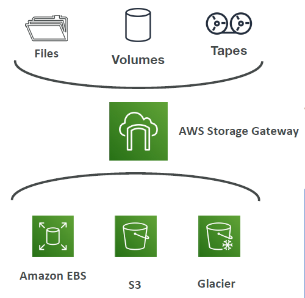

# Amazon S3

- [Amazon S3](#amazon-s3)
	- [Introduction](#introduction)
	- [S3 Use cases](#s3-use-cases)
	- [Amazon S3 Overview - Buckets](#amazon-s3-overview---buckets)
	- [Amazon S3 Overview - Objects](#amazon-s3-overview---objects)
	- [Amazon S3 - Security](#amazon-s3---security)
	- [S3 Bucket Policies](#s3-bucket-policies)
		- [Example: Public Access - Use Bucket Policy](#example-public-access---use-bucket-policy)
		- [Example: User Access to S3 - IAM permissions](#example-user-access-to-s3---iam-permissions)
		- [Example: EC2 instance access - Use IAM Roles](#example-ec2-instance-access---use-iam-roles)
		- [Example: Advanced: Cross-Account Access - Use Bucket Policy](#example-advanced-cross-account-access---use-bucket-policy)
		- [Example: Bucket Settings for Block Public Access](#example-bucket-settings-for-block-public-access)
	- [S3 - Static Website Hosting](#s3---static-website-hosting)
	- [S3 - Versioning](#s3---versioning)
	- [S3 Replication (CRR \& SRR)](#s3-replication-crr--srr)
	- [S3 Storage Classes](#s3-storage-classes)
		- [S3 Durability and Availability](#s3-durability-and-availability)
		- [S3 Standard - General Purpose](#s3-standard---general-purpose)
		- [S3 Storage Classes - Infrequent Access](#s3-storage-classes---infrequent-access)
			- [S3 Standard Infrequent Access (S3 Standard-IA)](#s3-standard-infrequent-access-s3-standard-ia)
			- [S3 One Zone Infrequent Access (S3 One Zone-IA)](#s3-one-zone-infrequent-access-s3-one-zone-ia)
		- [Amazon S3 Glacier Storage Classes](#amazon-s3-glacier-storage-classes)
			- [Amazon S3 Glacier Instant Retrieval](#amazon-s3-glacier-instant-retrieval)
			- [Amazon S3 Glacier Flexible Retrieval (formerly Amazon S3 Glacier)](#amazon-s3-glacier-flexible-retrieval-formerly-amazon-s3-glacier)
			- [Amazon S3 Glacier Deep Archive - for long term storage](#amazon-s3-glacier-deep-archive---for-long-term-storage)
		- [S3 Intelligent-Tiering](#s3-intelligent-tiering)
	- [S3 Storage Classes Comparison](#s3-storage-classes-comparison)
	- [S3 Storage Classes - Price Comparison](#s3-storage-classes---price-comparison)
		- [Example: us-east-1](#example-us-east-1)
	- [S3 Encryption](#s3-encryption)
	- [IAM Access Analyzer for S3](#iam-access-analyzer-for-s3)
	- [Shared Responsibility Model for S3](#shared-responsibility-model-for-s3)
	- [AWS Snow Family Overview](#aws-snow-family-overview)
		- [AWS Snowball](#aws-snowball)
		- [Data Migrations with AWS Snowball](#data-migrations-with-aws-snowball)
		- [Time to Transfer](#time-to-transfer)
	- [Diagrams](#diagrams)
	- [What is Edge Computing?](#what-is-edge-computing)
	- [Snowball Edge Pricing](#snowball-edge-pricing)
	- [Hybrid Cloud for Storage](#hybrid-cloud-for-storage)
	- [AWS Storage Cloud Native Options](#aws-storage-cloud-native-options)
	- [AWS Storage Gateway](#aws-storage-gateway)
	- [AWS Snowcone](#aws-snowcone)
	- [AWS Snowmobile](#aws-snowmobile)
	- [Amazon S3 - Summary](#amazon-s3---summary)

## Introduction

- Amazon S3 is one of the main building blocks of AWS
- It's advertised as "infinitely scaling" storage
- Many websites use Amazon S3 as a backbone
- Many AWS services use Amazon S3 for integrations as well

## S3 Use cases

- Backup and storage - for your files and for your disks
- Disaster Recovery - you will move your data to another region in case your region goes down 
- Archive - you can archive files in S3 and retrieve it at a later stage for much, much cheaper
- Hybrid Cloud storage - in case you have storage on-premises, but you want to expand it into the cloud
- Application hosting
- Media hosting - hosting video files, images and so on
- Data lakes & big data analytics - to store a lot of data and perform big data analytics
- Software delivery
- Static website

**Use Cases:** 
- NASDAQ stores 7 years of data into the S3 glacier which is the archival service in S3
- Sysco runs analytics on its data and gains business insights from Amazon S3

  

## Amazon S3 Overview - Buckets

- Amazon S3 allows people to store objects (files) in "buckets" (directories)
- Buckets must have a **globally unique name (across all regions you have in your accounts, but also all the accounts that exist out there on AWS)**
- Buckets must be defined in a specific **region** even though the name of the bucket is unique across all regions and all the accounts
- **S3 looks like a global service but buckets are created in a region**
- Naming convention
  - No uppercase
  - No underscore
  - 3-63 characters long
  - Not an IP
  - Must start with lowercase letter or number
  - Must NOT start with the prefix **xn--** since it is reserved for **internationalized domain names (IDNs)**
  - Must NOT end with the suffix **-s3alias** since it is reserved for **S3 Access Point aliases**

## Amazon S3 Overview - Objects

- Objects (files) have a Key
- Amazon S3 object **key** is the FULL path of your file:
  - s3://my-bucket/my_file.txt - Here **my-bucket** is the top level directory. Key of **my_file.txt** is **my_file.txt**
  - s3://my-bucket/my_folder1/another_folder/my_file.txt - In case you want to nest it what we call folders, then the key of **my_file.txt** is **my_folder1/another_folder/my_file.txt**
- The key is composed of **prefix** + **object name**
  - s3://my-bucket/my_folder1/another_folder/my_file.txt - **prefix** is **my_folder1/another_folder** and **object name** is **my_file.txt**
- There's no concept of "directories" within buckets (although the UI will trick you to think otherwise)
- Just keys with very long names that contain slashes ("/") and keys are made up of prefix and object name
- Object values are the content of the body:
  - Max Object Size is 5TB (5000GB)
  - If uploading more than 5GB, must use "multi-part upload" to upload that file into several parts. If you have a file of 5TB, then you must upload at least 1000 parts of 5GB each
- Metadata (list of text key / value pairs – system or user metadata)
- Tags (Unicode key / value pair – up to 10) – useful for security / lifecycle
- Version ID (if versioning is enabled)

## Amazon S3 - Security

- **User based**
  - IAM policies - As a user you can have IAM policies attached to you and the IAM policies will authorize which API calls should be allowed for a specific user from IAM console
- **Resource Based**
  - **Bucket Policies** - they are the most common way of to do security and we can assign bucket wide rules directly from the S3 console. This allow a specific user to come in or allow a user from another account to access your S3 buckets. This is how you can make your **S3 buckets public**
  - **Object Access Control List (ACL)** – they are finer grain security and they can be disabled
  - **Bucket Access Control List (ACL)** – they are way less common and they can be disabled
- **Note:** Below are the situations in which **an IAM principal can access an S3 object on the specified API call**:
  - if the IAM permissions ALLOW it OR if the resource policy ALLOWS it
  - AND there’s no explicit DENY in the action
- **Encryption:** another way of doing security on S3 buckets is to encrypt objects in Amazon S3 using encryption keys

## S3 Bucket Policies

- **JSON based policies**
  - Resources: specifies what buckets and objects this policy applies on. In the example, it applies to all the objects within the example bucket and this is what the star (*) is for
  - Effect: We allow / deny actions
  - Actions: Set of API to Allow or Deny. In the example, the action we allow is GetObject to anyone since the Principal is star (*)
   Principal: The account or user to apply the policy to
- Use S3 bucket for policy to:
  - Grant public access to the bucket
  - Force objects to be encrypted at upload
  - Grant access to another account (Cross Account)

```json
{
  "Version": "2012-10-17",
  "Statement": [
    {
      "sid": "PublicRead",
      "Effect": "Allow",
      "Principal": "*",
      "Action": [
        "s3:GetObject"
      ],
      "Resource": [
        "arn:aws:s3::examplebucket/*"
      ]
    }
  ]
}
```

### Example: Public Access - Use Bucket Policy

- We have a user on the internet who wants to access our S3 buckets.
- We will attach an S3 bucket policy that allows public access then the user can access any objects within it.

  

### Example: User Access to S3 - IAM permissions

- If you have an IAM user within your account and he wants to access S3 bucket, then we can assign IAM permissions to that user through a policy. Therefore because the policy allows access to the S3 buckets then the user can access our S3 buckets.

  

### Example: EC2 instance access - Use IAM Roles

- If you have an EC2 instance and want to give access from the EC2 instance into the S3 buckets, we have seen that IAM users are not appropriate, we need to use IAM roles instead.
- We create an EC2 instance role with the correct IAM permissions then EC2 instance will be able to access Amazon S3 buckets.

  

### Example: Advanced: Cross-Account Access - Use Bucket Policy

- More advanced, if you want to allow Cross-Account access, then you must use a bucket policy.
- We have an IAM user in another AWS account, we create an S3 bucket policy that allows Cross-Account access for that specific IAM user therefore the IAM user will be able to make API calls into our S3 buckets.

  

### Example: Bucket Settings for Block Public Access

- Other security settings that you need to know about is that there is the bucket settings for Block Public Access
- We set the values to "On" when we created the buckets

  

- These settings were invented by AWS as an extra layer of security to prevent company data leaks
- Even though you would set an S3 bucket policy that would make it public, if these settings are enabled, the bucket will never be public to prevent data leaks. If you know that your buckets should never be public then leave these settings on.
- If you know none of your S3 buckets should be public, then you can set this at the account level

## S3 - Static Website Hosting

- S3 can host static websites and have them accessible on the internet
- The website URL depending on the AWS region where you create it will be either of these two:
  - **bucket-name.s3-website-aws-region.amazonaws.com**
  - **bucket-name.s3-website.aws-region.amazonaws.com**
- We have an S3 buckets containing files, maybe HTML files, maybe images, then we are going to enable this to be compatible with hosting a website.
- Then our users will try to access our S3 buckets it will not work as we do not have public reads enabled on our S3 buckets.
- **If you get a 403 (Forbidden) error, after enabling your S3 buckets for reads, then make sure to attach an S3 bucket policy that allows it to be public!**

## S3 - Versioning

- Once you have created a website, but it would be nicer to be able to update it in a safe way
- You can version your files in Amazon S3
- It is enabled at the **bucket level**.
- We have our bucket enabled with versioning and whenever a user uploads a file, it is going to create a version of that file at the selected key
- And then should we re-upload the same key and overwrite the file, it is going to increment the "version" from 1 to 2, 3, and so on

  

- Therefore it is a best practice to version your buckets because it would
  - protect against unintended deletes (ability to restore a version). For example, if you delete a file version, it just adds a delete marker and you can restore versions that were previously there instead 
  - be easy to roll back to previous version
- Notes:
  - Any file that is not versioned prior to enabling versioning will have version “null” - Suspending versioning does not delete the previous versions

## S3 Replication (CRR & SRR)

- If we have two buckets in two separate region (eu-west-1 and us-east-2) and we want to setup an asynchronous replication between these two buckets. To do so, we must first enable versioning in source and destination buckets. **Replication only works if Versioning is enabled**

  

- Cross Region Replication (CRR) - two regions must be different
- Same Region Replication (SRR) - two regions must be same
- It is possible that these two buckets can be in different accounts
- Copying is asynchronous and replication happens behind the scenes
- Must give proper IAM permissions to S3 buckets to read and write from specified buckets
- CRR - Use cases: compliance, lower latency access, replication across accounts
- SRR – Use cases: log aggregation, live replication between production and test accounts

## S3 Storage Classes

- [Amazon S3 Standard - General Purpose](#s3-standard-general-purpose)
- [Amazon S3 Standard - Infrequent Access (IA)](#s3-standard-infrequent-access-s3-standard-ia)
- [Amazon S3 One Zone - Infrequent Access](#s3-one-zone-infrequent-access-s3-one-zone-ia)
- [Amazon S3 Glacier Instant Retrieval](#amazon-s3-glacier-instant-retrieval)
- [Amazon S3 Glacier Flexible Retrieval](#amazon-s3-glacier-flexible-retrieval-formerly-amazon-s3-glacier)
- [Amazon S3 Glacier Deep Archive](#amazon-s3-glacier-deep-archive-–-for-long-term-storage)
- [Amazon S3 Intelligent Tiering](#s3-intelligent-tiering)

- Can move between classes manually or using **S3 Lifecycle Rules** under **Management** tab to move objects automatically between all these storage classes

### S3 Durability and Availability

- **Durability:**
  - Durability represents how many times an object could be lost by Amazon
  - Amazon has high durability of objects across multiple AZs and it is called eleven 9's (99.999999999%)
  - If you store 10,000,000 objects with Amazon S3, you can on average expect to incur a loss of a single object once every 10,000 years
  - Durability is same for all storage classes
- **Availability:**
  - Availability represents how readily available a service is
  - Varies depending on storage class
  - Example: S3 standard has 99.99% availability = not available 53 minutes a year

### S3 Standard - General Purpose

- 99.99% Availability
- Used for frequently accessed data
- Low latency and high throughput
- Sustain 2 concurrent facility failures
- **Use Cases:** Big Data analytics, mobile & gaming applications, content distribution…

### S3 Storage Classes - Infrequent Access

- For data that is less frequently accessed, but requires rapid access when needed
- Lower cost than S3 Standard

#### S3 Standard Infrequent Access (S3 Standard-IA)

- 99.9% Availability
- **Use cases:** Disaster Recovery, backups

#### S3 One Zone Infrequent Access (S3 One Zone-IA)

- High durability (99.999999999%) in a single AZ; data will be lost when AZ is destroyed
- 99.5% Availability
- **Use Cases:** Storing secondary backup copies of on-premise data, or data you can recreate

### Amazon S3 Glacier Storage Classes

- Low-cost object storage meant for archiving / backup
- Pricing: price for storage + object retrieval cost

#### Amazon S3 Glacier Instant Retrieval

- Millisecond retrieval, great for data accessed once a quarter
- Minimum storage duration of 90 days

#### Amazon S3 Glacier Flexible Retrieval (formerly Amazon S3 Glacier)

- Expedited (1 to 5 minutes), Standard (3 to 5 hours), Bulk (5 to 12 hours) – free
- Minimum storage duration of 90 days

#### Amazon S3 Glacier Deep Archive - for long term storage

- Standard (12 hours), Bulk (48 hours)
- You may be ready to wait for a lot of time, but it is going to give you the lowest cost
- Minimum storage duration of 180 days

### S3 Intelligent-Tiering

- Moves objects automatically between Access Tiers based on usage patterns
- You are going to incur a small monthly monitoring and auto-tiering fee
- There are no retrieval charges in S3 Intelligent-Tiering
- **Frequent Access tier (automatic):** default tier
- **Infrequent Access tier (automatic):** objects not accessed for 30 days
- **Archive Instant Access tier (automatic):** objects not accessed for 90 days
- **Archive Access tier (optional):** configurable from 90 days to 700+ days
- **Deep Archive Access tier (optional):** config. from 180 days to 700+ days
- S3 Intelligent Tiering is there to allow you to sit back and relax while S3 moves objects between the tiers for you based on the amount of days the objects not accessed

## S3 Storage Classes Comparison

- This is just to make sense and not needed to be remembered for the exam

  

## S3 Storage Classes - Price Comparison
### Example: us-east-1

- This is just to make sense and not needed to be remembered for the exam

  

## S3 Encryption

- **Server-Side Encryption:** 
  - By default whenever you create a bucket or whenever you upload a object, it will be encrypted on the server side.
  - Server-Side Encryption is when the user uploads an object into Amazon S3, and when the object arrives in the bucket is going to be encrypted by Amazon S3 for security purposes
  - The idea is the server is doing the encryption and hence called Server-Side Encryption
- **Client-Side Encryption:**
  - On the flip side, we have Client-Side Encryption, where when the user will actually take a file, encrypt it before uploading it and then put it in the bucket

  

##  IAM Access Analyzer for S3

- Monitoring feature for your Amazon S3 buckets to ensure that only intended people have access to your S3 buckets
- Example: publicly accessible bucket, bucket shared with other AWS account…
- It is going to analyze your S3 Bucket Policies, S3 ACLs, S3 Access Point Policies and it is going to surface to you which buckets are going to be publicly accessible, which buckets are being shared with other AWS accounts and so on
- You as a user can review it and come to a conclusion as to which is normal, which was expected and which could possibly cause a security issue and immediately take necessary actions
- Powered by IAM Access Analyzer allowing you to find out resources in your account that are shared with other entities

  

## Shared Responsibility Model for S3

| AWS | YOU |
| --- | --- |
| Infrastructure (global security, durability, availability, sustain concurrent loss of data in two facilities) | S3 Versioning, S3 Bucket Policies, S3 Replication Setup |
| Configuration and vulnerability analysis | Logging and Monitoring, S3 Storage Classes |
| Compliance validation | Data encryption at rest and in transit |

## AWS Snow Family Overview
### AWS Snowball
- Highly-secure, portable devices to collect and process data at the edge, and migrate data into and out of AWS
- If you have a migration of say, Petabytes of data, Snowball may be a good usecase

  

- We have two kinds of Snowball Edge devices and the difference lies in their storage
  - **Snowball Edge Storage Optimized:**
    - Has 210TB storage
  - **Snowball Edge Compute Optimized:**
    - Has 28TB storage

### Data Migrations with AWS Snowball

- It takes a lot of time to transfer some data over a specific bandwidth speed
- For example, if you want to transfer a 100 TB over 1 GB per second connection, it will take you 12 days

- **Challenges:** When you have slow connection you may have
  - Limited connectivity
  - Limited bandwidth
  - High network cost
  - Shared bandwidth with other aplication (can’t maximize the line)
  - Connection stability
- When ever it takes more than a week to transfer data over the network, the recommendation is to use a Snowball device

### Time to Transfer

| Data   | 100 Mbps | 1Gbps    | 10Gbps   |
| ------ | -------- | -------- | -------- |
| 10 TB  | 12 days  | 30 hours | 3 hours  |
| 100 TB | 124 days | 12 days  | 30 hours |
| 1 PB   | 3 years  | 124 days | 12 days  |

## Diagrams

- **Direct Upload to S3:**
  - If you upload directly to Amazon S3, it is simple but it may utilize all the bandwidth
- **With Snowball:**
  - If you use a snowball device, you are going to receive a physical Snowball device, you connect to your physical machine, load it with the data you need, and then finally you ship it back to AWS. Then you will be having an export process within AWS to take your data from the Snowball device onto, for example, an S3 bucket.

  

## What is Edge Computing?

- Process data while it’s being created on an edge location
  - A truck on the road, a ship on the sea, a mining station underground...
  
  

- These locations may have
  - Limited / no internet access
  - Limited / no easy access to computing power
- We setup a **Snowball Edge** device to do edge computing
  - Snowball Edge Compute Optimized (dedicated for that use case) & Storage Optimized
  - Because they have computing capability, we can run an EC2 Instances or Lambda functions directly on these devices at the edge.
- By using an edge computing device, we can:
  - Preprocess data
  - Do machine learning at the edge
  - Directly transcode the media streams at the edge
- Eventually (if need be) we can ship back the device for transferring data back to AWS

## Snowball Edge Pricing

- You pay for **device usage** and **data transfer out of AWS**
- Data transfer IN to Amazon S3 is $0.00 per GB **(putting data into AWS is free)**
- For pricing of the device itself we have two levels:
  - **On-Demand:**
    - Includes a one-time service fee per job, which includes:
      - **10 days** of usage for **Snowball Edge Storage Optimized 80TB**
      - **15 days** of usage for **Snowball Edge Storage Optimized 210TB**
      - Shipping days are NOT counted towards the included 10 or 15 days. 
      - Only days of usage is counted
      - Pay per day for any additional days (that is after 10 or 15 days)
  - **Committed Upfront:**
    - Pay in advance for monthly, 1-year, and 3-years of usage **(Edge Computing)**
    - Up to 62% discounted pricing

## Hybrid Cloud for Storage

- AWS is pushing for "hybrid cloud"
  - Part of your infrastructure is on-premises
  - Part of your infrastructure is on the cloud
- This can be due to sometimes the on-premises infrastructure was created first and it could be for
  - Long Cloud migrations
  - Security requirements
  - Compliance requirements
  - IT strategy
- S3 is a proprietary storage technology (unlike EFS / NFS), so how do you expose the S3 data on-premise?
- AWS Storage Gateway!

## AWS Storage Cloud Native Options

- To summarize the storage options on AWS: 
  - The block storage would be Amazon EBS or an Amazon EC2 Instance Store
  - The file storage would be a network file system which is Amazon EFS
  - The object storage would be Amazon S3 or Amazon S3 Glacier

  

  - Where does Amazon Storage Gateway fit in all this?

## AWS Storage Gateway

- AWS Storage Gateway is going to be a bridge between on-premise data and cloud data in AWS
- **This hybrid storage service will allow your on-premises systems to seamlessly use the AWS Cloud**
- **Use cases:** disaster recovery, backup & restore, tiered storage
- Types of Storage Gateway:
  - File Gateway
  - Volume Gateway
  - Tape Gateway
- No need to know the types at the exam but Storage gateway will allows you to bridge whatever happens on-premises directly into the AWS cloud. So under the hood, AWS Storage Gateway will be using Amazon EBS, Amazon EFS, Amazon S3, Amazon Glacier and so on   

  

## AWS Snowcone

- Small, portable computing, anywhere, rugged & secure, withstands harsh environments
- Light (4.5 pounds, 2.1 kg)
- Device used for edge computing, storage, and data transfer
- **8 TBs of usable storage**
- Use Snowcone where Snowball does not fit (space-constrained environment)
- Must provide your own battery / cables
- Can be sent back to AWS offline, or connect it to internet and use **AWS DataSync** to send data

## AWS Snowmobile

- Transfer exabytes of data (1 EB = 1,000 PB = 1,000,000 TBs)
- Each Snowmobile has 100 PB of capacity (use multiple in parallel)
- High security: temperature controlled, GPS, 24/7 video surveillance
- **Better option than a Snowball if you transfer more than 10 PB**

| Properties | Snowcone | Snowball Edge Storage Optimized | Snowmobile |
| ---------- | -------- | ------------------------------- | ---------- |
| Storage Capacity | 8 TB usable | 80 TB usable | < 100 PB |
| Migration Size | Up to 24 TB, online and offline | Up to petabytes, offline | Up to exabytes, offline |

## Amazon S3 - Summary

- Buckets vs Objects: global unique name, tied to a region
- S3 security: IAM policy, S3 Bucket Policy (public access), S3 Encryption
- S3 Websites: host a static website on Amazon S3
- S3 Versioning: multiple versions for files, prevent accidental deletes
- S3 Access Logs: log requests made within your S3 bucket
- S3 Replication: same-region or cross-region, must enable versioning
- S3 Storage Classes: Standard, Standard IA, 1Z-IA, Intelligent, Glacier Instant, Glacier Flexible, Glacier Deep Archive
- S3 Lifecycle Rules: transition objects between classes
- Snow Family: import data onto S3 through a physical device, edge computing
- OpsHub: desktop application to manage Snow Family devices
- Storage Gateway: hybrid solution to extend on-premises storage to S3